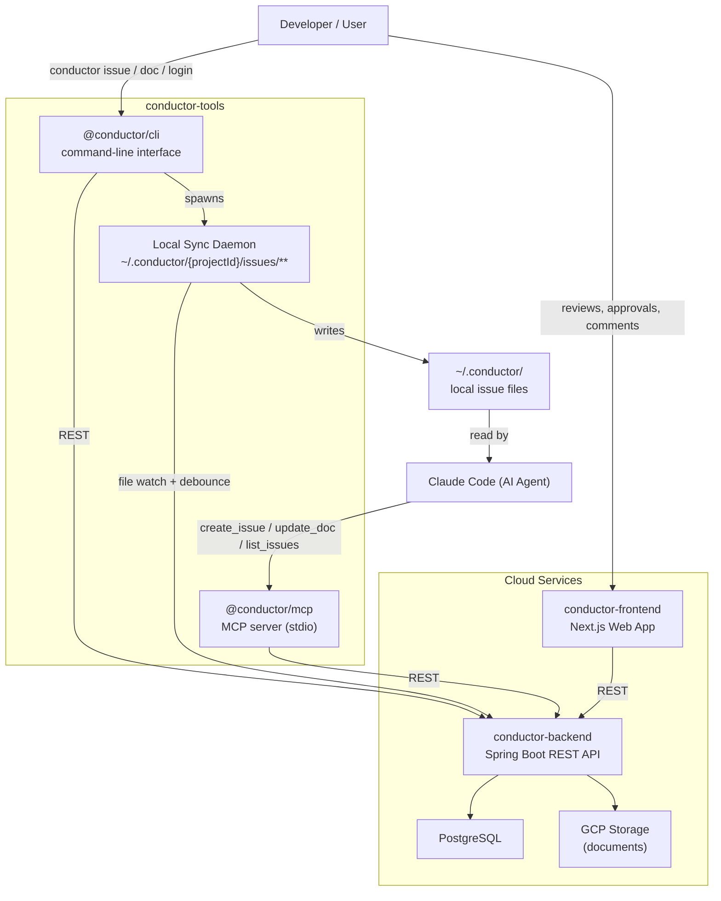

# Conductor

Team PRD collaboration platform. Claude Code generates PRDs; Conductor handles review, approval, and team workflow — bridging AI-assisted spec writing with structured team processes.

## How it works



**User flow**: Authenticate with `conductor login`, initialize a project with `conductor init`, then use `conductor start` to run the local sync daemon. Issues created via the CLI or MCP tools sync to local files at `~/.conductor/{projectId}/issues/`, which Claude Code reads directly to work with your specs.

**Agent flow**: Claude Code uses the MCP server (`@conductor/mcp`) to create issues, write document drafts, and fetch issue lists — without any manual copy-paste.

## Project Structure

```
conductor/                          # monorepo root
├── conductor-backend/              # Spring Boot 4, Java 21, Maven
│   └── src/main/
│       ├── java/com/conductor/
│       │   ├── config/             # Spring Security, GCP, RestTemplate
│       │   ├── controller/         # REST controllers (OpenAPI-generated interfaces)
│       │   ├── entity/             # JPA entities
│       │   ├── repository/         # Spring Data JPA
│       │   ├── service/            # business logic
│       │   └── security/           # JWT + API key filters, Firebase verification
│       └── resources/
│           ├── openapi.yaml        # source of truth for all API endpoints
│           └── db/migration/       # Flyway migrations (PostgreSQL 15)
│
├── conductor-frontend/             # Next.js 14, TypeScript, Tailwind, shadcn/ui
│   └── src/
│       ├── app/                    # App Router pages (projects, issues, invites, login)
│       ├── components/             # comments, reviews, markdown, members, shadcn/ui
│       ├── contexts/               # AuthContext (Firebase + JWT), ProjectContext
│       └── lib/api.ts              # apiGet / apiPost / apiPatch / apiDelete helpers
│
└── conductor-tools/                # @conductor/cli — see conductor-tools/README.md
│
├── docker-compose.yml              # local dev stack (backend, frontend, postgres)
├── Makefile                        # dev, build, logs, down, seed, e2e, e2e-ui
└── scripts/logs.sh                 # fetch Cloud Run logs from GCP
```

## Local Development

### Prerequisites

- Docker + Docker Compose
- Node.js 20+
- Java 21 + Maven (for backend-only changes)

### Start the full stack

```bash
make dev         # build and start all services (backend, frontend, postgres)
make logs        # tail all service logs
make down        # stop all services
```

### Seed test data

After the stack is running:

```bash
make seed        # creates a demo project with dev@example.com / conductor
```

### Run E2E tests

```bash
make e2e         # headless Playwright tests against the running stack
make e2e-ui      # open Playwright UI mode
```

### Unit tests

```bash
# Backend
cd conductor-backend && mvn test

# Frontend
cd conductor-frontend && npx vitest

# CLI
cd conductor-tools && npx vitest
```

## CLI

See the [CLI README](conductor-tools/README.md).

