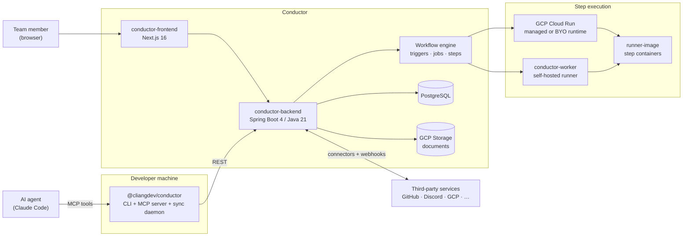

# Conductor

[](LICENSE)
[](https://github.com/cliangdev/conductor/actions/workflows/backend-ci.yml)
[](https://github.com/cliangdev/conductor/actions/workflows/frontend-ci.yml)
[](https://github.com/cliangdev/conductor/actions/workflows/tools.yml)
[](https://www.npmjs.com/package/@cliangdev/conductor)

The coordination layer for an agentic organization. AI agents do the work — author specs, write code, run campaigns, maintain the wiki. Humans review, approve, and steer. Conductor is where the two meet: shared work items, automated workflows, a living knowledge base, and connections to the tools your organization already uses.

## What's in the platform

- **Work Items & Reviews** — typed work (PRDs, issues, campaigns, anything) with documents, line-level comments, reviewers, and approval gates. Types and statuses come from your workflows, not hardcoded enums.
- **Workflows** — two complementary kinds:
  - *Lifecycle statecharts* define how a Work Item moves through states (draft → review → approved → build), including which agent or human acts at each step.
  - *YAML automation* runs jobs on schedule, webhook, or event triggers — with agent, claude-code, docker, http, and integration action steps, artifacts, secrets, and loops. See [docs/workflows.md](docs/workflows.md).
- **Agents** — bring-your-own-key model personas with tools drawn from connectors and custom HTTP tools. Agent runs are fully transcripted for observability.
- **Knowledge Center** — an ingestion inbox feeding an agent-maintained wiki. Librarian workflows organize incoming knowledge into reviewed, versioned pages. See [docs/knowledge.md](docs/knowledge.md).
- **Integrations** — a unified connector framework (OAuth, webhooks, fetch, actions): GitHub, Discord, GCP, Apple Search Ads, Google Search Console, PostHog, RevenueCat, Meta, YouTube, TikTok, and more. See [docs/integrations-adding-a-connector.md](docs/integrations-adding-a-connector.md).
- **Publishing** — take a Work Item through review to something live on a platform. Per-post scheduling on a calendar, an approval bound to the exact media and destinations it was given for, and per-destination outcomes with the live link. Publishes through Facebook, Instagram, YouTube and TikTok, or through a human by hand when there is no integration. See [docs/publishing.md](docs/publishing.md).

## Architecture


```mermaid
flowchart LR
    Human["Team member<br/>(browser)"]
    Agent["AI agent<br/>(Claude Code)"]

    subgraph Local["Developer machine"]
        Tools["@cliangdev/conductor<br/>CLI + MCP server + sync daemon"]
    end

    subgraph Cloud["Conductor"]
        UI["conductor-frontend<br/>Next.js 16"]
        API["conductor-backend<br/>Spring Boot 4 / Java 21"]
        Engine["Workflow engine<br/>triggers · jobs · steps"]
        DB[("PostgreSQL")]
        GCS[("GCP Storage<br/>documents")]
    end

    subgraph Exec["Step execution"]
        CloudRun["GCP Cloud Run<br/>managed or BYO runtime"]
        Worker["conductor-worker<br/>self-hosted runner"]
        Runner["runner-image<br/>step containers"]
    end

    Ext["Third-party services<br/>GitHub · Discord · GCP · …"]

    Human --> UI --> API
    Agent -- "MCP tools" --> Tools -- "REST" --> API
    API --> DB
    API --> GCS
    API --> Engine
    Engine --> CloudRun --> Runner
    Engine --> Worker --> Runner
    API <-- "connectors + webhooks" --> Ext
```

**Human flow**: review and approve work in the web app — documents, comments, reviews, workflow runs, knowledge pages.

**Agent flow**: Claude Code (or any MCP client) uses the `conductor` MCP server to create and transition work items, write documents, dispatch workflows, search and update knowledge, and call integration tools — no copy-paste.

**Execution flow**: workflow jobs run as containers on GCP Cloud Run (Conductor-managed or your own via `runs-on` runtime targets) or on a self-hosted `conductor-worker` next to your own Docker daemon.

## Repository layout

```
conductor/
├── conductor-backend/     # Spring Boot 4, Java 21 — REST API, workflow engine, connectors
├── conductor-frontend/    # Next.js 16, TypeScript, Tailwind, shadcn/ui
├── conductor-tools/       # @cliangdev/conductor — CLI + MCP server (single npm package)
├── conductor-worker/      # self-hosted job runner (Express + Docker)
├── runner-image/          # container images for workflow step execution
├── docs/                  # architecture and contributor guides (see below)
├── docker-compose.yml     # local dev stack (db, backend, frontend)
└── Makefile               # dev, seed, e2e, logs, cli-install, ...
```

## Quick start (local development)

Prerequisites: Docker + Docker Compose, Node.js 22+, Java 21 + Maven (backend work only).

```bash
make dev         # build + start db/backend/frontend, seed demo data
                 # → http://localhost:3000 (dev@example.com / conductor)
make logs        # tail all service logs
make down        # stop everything
```

Tests:

```bash
cd conductor-backend && mvn test        # backend (Testcontainers)
cd conductor-frontend && npx vitest     # frontend unit
cd conductor-tools && npx vitest        # CLI + MCP
make e2e                                # Playwright against the running stack
```

CLI + MCP for agent use: see the [conductor-tools README](conductor-tools/README.md) — `conductor login`, `conductor init`, `conductor mcp`.

## Documentation

| Doc | What it covers |
|---|---|
| [docs/workflows.md](docs/workflows.md) | Workflow YAML, triggers, step types, execution modes, self-hosted runners |
| [docs/knowledge.md](docs/knowledge.md) | Knowledge Center: ingestion, wiki model, librarian workflows |
| [docs/publishing.md](docs/publishing.md) | Publishing: the approval gate, publish targets and lanes, outcomes, the manual lane |
| [docs/api-guidelines.md](docs/api-guidelines.md) | OpenAPI-first workflow, external vs internal API split |
| [docs/mcp-tool-guidelines.md](docs/mcp-tool-guidelines.md) | MCP tool design principles |
| [docs/integrations-adding-a-connector.md](docs/integrations-adding-a-connector.md) | Building a new connector |
| [docs/design-system.md](docs/design-system.md) | Frontend design tokens and patterns |
| [docs/dev-workflow.md](docs/dev-workflow.md) | PR deploy labels, live testing, log access |

## Contributing

Contributions are welcome — bug reports, docs, and code. See [CONTRIBUTING.md](CONTRIBUTING.md) for local setup, PR workflow, and coding conventions. All contributors agree to our [Code of Conduct](CODE_OF_CONDUCT.md) and sign a lightweight [CLA](.github/CLA.md) on their first PR (a bot prompts you automatically).

## Security

Found a vulnerability? Please report it privately via [GitHub Security Advisories](https://github.com/cliangdev/conductor/security/advisories/new) — do not open a public issue. See [SECURITY.md](SECURITY.md) for scope and response expectations.

## License

Conductor is licensed under the [PolyForm Noncommercial License 1.0.0](LICENSE). You are free to use, modify, and distribute Conductor for personal and non-commercial purposes — including hobby projects, research, and use by charitable, educational, or government organizations.

**Commercial use requires a separate license.** If you'd like to use Conductor commercially, please open a [GitHub Discussion](https://github.com/cliangdev/conductor/discussions) or contact [@cliangdev](https://github.com/cliangdev).
