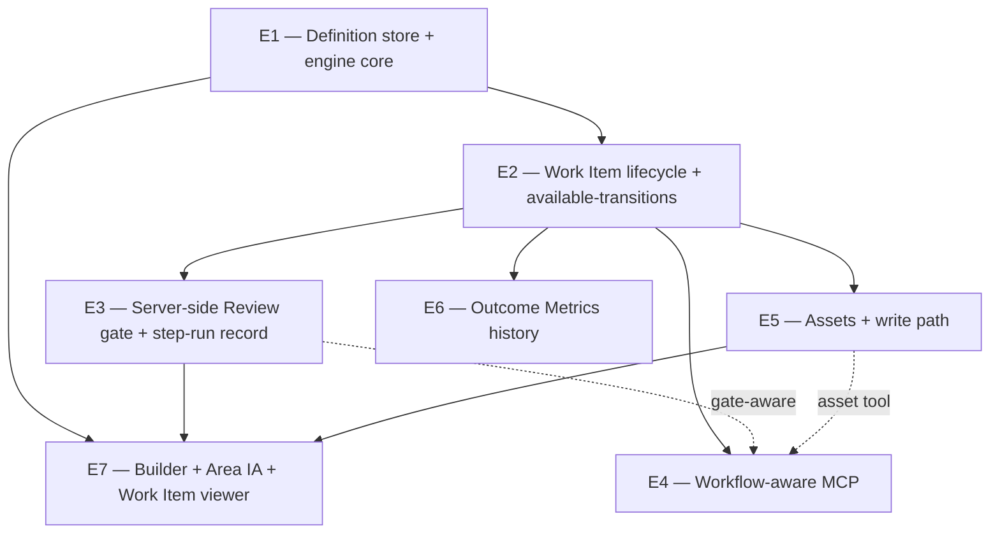

# COND-18 Foundation — Epic Breakdown

> COND-18 ("Conductor Workflows — Foundation") is too large for one PR or one `/conductor:implement`
> run. This breaks it into **7 implementable sub-issues** along the readiness assessment's phases, each
> sized for a single implement run, with explicit dependencies and the gating contracts each consumes.
> The contracts (authored first) live under `conductor-backend/src/main/resources/schema/` and in
> `openapi.yaml`; see `docs/workflow-definition-schema.md`.

## Dependency graph

## Sub-issues

### E1 — Workflow definition store + engine core (Phase 1a) · backend
- **Scope:** Extend `workflow_definitions` (`version`, `state` DRAFT/PUBLISHED, `area`, `definition JSONB`,
  `schemaVersion`). Build `WorkflowDefinitionValidator` (structural via the JSON Schema + the semantic
  `x-semantic-rules`) as the **sole write path**. Migrate existing YAML automations into no-status
  `definition` JSON; deprecate `yaml` after one release. Seed the `ENGINEERING` definition.
- **Consumes:** `schema/workflow-definition-v1.schema.json`, `schema/examples/engineering.workflow.json`,
  `schema/skill-registry-v1.schema.json`.
- **Bar:** the seeded `ENGINEERING` definition validates and equals today's `VALID_TRANSITIONS` exactly
  (incl. `CLOSED` + `IN_REVIEW→DRAFT` back-edge). Migrated YAML automations still run.
- **Depends on:** — (contracts already authored).

### E2 — Work Item lifecycle binding + available-transitions (Phase 1b) · backend
- **Scope:** Add nullable `workflow`, `workflow_version`, `current_status`, `state_context JSONB`,
  `parent_work_item_id` to `issues`; backfill existing rows to `ENGINEERING` at their current status.
  Build the `WorkflowEngine` (resolve definition+version, validate string transitions, write a transition
  log, `availableTransitions(workItem, actor)` projection). Route `PATCH /issues/{id}` status through the
  engine; implement `GET /issues/{id}/available-transitions`; accept optional `workflow` on create.
- **Consumes:** OpenAPI `listAvailableTransitions`, `CreateIssueRequest.workflow`.
- **Bar:** `AC-P0-1.1` — existing issues transition **identically** (regression test); `AC-P0-1.2/.5/.9/.10`.
- **Depends on:** E1.

### E3 — Server-side Review gate + step-run record (Phase 2 / P0-1.3, P0-6) · backend + frontend
- **Scope:** Enforce `requiresReview` — block the transition until a recorded approval (work-item id is the
  resume handle). Add the step-run record store + the MCP write path; build the P0-6 gate UI (brief +
  produced artifact rendered naturally + before/after + flags + approve/request-changes, append-only
  attribution). Flip the `ENGINEERING` `CODE_REVIEW→DONE` gate **on** as the deliberate behavior change.
- **Consumes:** `schema/step-run-record-v1.schema.json`.
- **Bar:** `AC-P0-1.3`, `AC-P0-6.1`–`6.4`.
- **Depends on:** E2.

### E4 — Workflow-aware MCP surface (Phase 3 / G6) · tools/CLI
- **Scope:** Generic discovery + transition tools — `list_workflows`, `create_work_item`,
  `get_available_transitions`, `transition_work_item` (+ asset & run-metadata tools from E5/E3). Resolve
  NL→slug; respect the doer projection; **no per-workflow generated tools**. Bump the CLI version.
- **Bar:** `conductor:prd`/`implement` walk via `get_available_transitions` rather than the hardcoded table.
- **Depends on:** E2 (gate-aware once E3 lands).

### E5 — Assets + write path (Phase 4a / P0-4) · backend + tools
- **Scope:** `assets` table + `AssetsController` (implements the generated `AssetsApi`); migrate
  `Issue.github_pr_url` → a `github_pr` Asset; `conductor:implement` records the PR as an Asset via MCP.
- **Consumes:** OpenAPI assets endpoints (`listAssets`/`createAsset`/`patchAsset`/`deleteAsset`).
- **Bar:** `AC-P0-4.1`–`4.4`.
- **Depends on:** E2 (asset MCP tool coordinates with E4).

### E6 — Outcome Metrics history (Phase 4b / P0-5) · backend
- **Scope:** Append-only metric time series on a Work Item/Asset; manual web entry + programmatic MCP entry;
  top-performer / regression queries by direction.
- **Bar:** `AC-P0-5.1`–`5.2` (Engineering opts out cleanly).
- **Depends on:** E2.

### E7 — Workflow Builder + Area IA + Work Item viewer (Phase 5 / P0-2, P0-3) · frontend
- **Scope:** Admin-only no-code Builder (structured split-panel + read-only graph preview), two-tier
  validation UX, hard-limit explanations, Draft→Publish + impact preview; Area-grouped sidebar (single-
  Workflow Areas flat); Work Item viewer with Documents/Assets/Review panels.
- **Consumes:** `publishWorkflow`, the validator (E1), available-transitions (E2), assets (E5).
- **Bar:** `AC-P0-2.*`, `AC-P0-3.*`.
- **Depends on:** E1, E2, E3, E5. **May split** into E7a (Builder) + E7b (IA + viewer) if too large for one run.

## Deferred (tracked, not yet sub-issues)
- **Unattended skill-Step runner** (G1) — needed by COND-19 Marketing cron loops, not Engineering v1.
- **Post-v1 connector Steps/Triggers** (`connector_fetch`/`connector_event`) — the shipped Integration
  context bound behind the DDD seam; specified as COND-19 configurations, reserved in the v1 schema.

## Suggested issue type / first slice
Create E1–E7 as `FEATURE_REQUEST` issues linked under COND-18. **E1 is the first buildable slice** — it has
no dependencies now that the contracts are authored, and it lands the engine + validator + Engineering seed
with zero behavior change.
