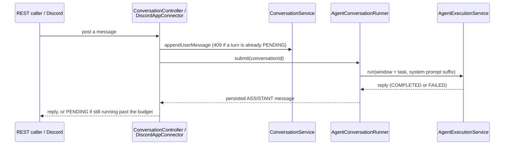

# Conversations & the CEO Agent

A **conversation** is a multi-turn, threaded exchange between a human (or an external channel like
Discord) and one **addressable agent** — an agent that opts into being talked to directly, not just run
from a workflow step. Every project gets a self-healing default addressable agent, the **CEO agent**
(slug `ceo`): a general-purpose coordinator with read/write tools across Work Items, Workflows, Agents,
and project docs, so "ask the project something" has a sensible target even before anyone configures a
specialist. It's seeded on the `claude` provider; switch it (or any agent) to any other configured
provider from **Automation → Agents** — see [`docs/ai-providers.md`](ai-providers.md).

## Table of contents

- [Concept](#concept)
- [Addressable agents](#addressable-agents)
- [The conversation bounded context](#the-conversation-bounded-context)
- [Coordinator tools](#coordinator-tools)
- [Memory (future seam)](#memory-future-seam)
- [REST endpoints](#rest-endpoints)
- [Discord setup guide](#discord-setup-guide)
- [Access control](#access-control)
- [Non-goals / future seams](#non-goals--future-seams)

---

## Concept

A conversation belongs to exactly one project, one agent, and one **channel** (`api` or `discord`).
Each turn is a `ConversationMessage`: a `USER` row (whatever the human/channel sent) followed by an
`ASSISTANT` row (the agent's reply, `PENDING` while the run is still in flight, then `COMPLETED` or
`FAILED`). `AgentConversationRunner` drives one turn end to end: load recent history, build a bounded
window, hand it to the same `AgentExecutionService` a workflow's `agent` step uses, persist the result.
A conversation is not a new execution engine — it's a thin, stateful front end onto the agent-run
machinery Conductor already has.



The two callers differ in *when* the reply is sent, which is why the diagram's last step reads
differently for each: the REST controller sends its HTTP response once the run finishes (or times out at
90s, see [REST endpoints](#rest-endpoints)) -- there is nothing to enqueue, the caller IS the request
thread. Discord's connector cannot do that (Discord's own ack budget for the deferred response is far
shorter than a model run) -- `DiscordAppConnector.handleEvent` only parses the interaction and enqueues
the entire rest of the flow (provisioning through every reply, success or error) onto the same bounded
executor `AgentConversationRunner#submit` uses, then returns immediately; the "reply" happens later, as
an outbound Discord API call (`editOriginal`) from that queued task, not as this request's HTTP response.

## Addressable agents

Any agent can opt in via `config.addressable: true` (surfaced on `AgentResponse.addressable`, badged
"Addressable" in the frontend). `AddressableAgentResolver` resolves a human-typed reference — a Discord
mention target, an API `agentName` field, or nothing at all — to exactly one `ACTIVE`, addressable agent
in the project:

1. Blank/omitted name → the `ceo` slug (self-healed by `CoordinatorProvisioner` on first use if it
   doesn't exist yet).
2. Otherwise, case-insensitive slug match first (unique per project, so at most one).
3. Falling back to display-name match; more than one name match with no agent whose slug exactly equals
   the attempted name is ambiguous (`409`) rather than picking arbitrarily.

An agent that is `ACTIVE` but not addressable stays reachable from workflow steps — it just isn't a
conversation target.

## The conversation bounded context

```
conductor-backend/src/main/java/com/conductor/conversation/
├── Conversation.java / ConversationMessage.java     # entities
├── ConversationRepository.java / ConversationMessageRepository.java
├── ConversationChannel.java                         # API | DISCORD
├── ConversationService.java                         # CRUD + lifecycle, actor attribution
├── AgentConversationRunner.java                      # drives one turn (sync submit + runNow core)
├── AddressableAgentResolver.java                     # name/slug → Agent resolution
├── AgentNotAddressableException.java
├── CoordinatorProvisioner.java                       # self-heals the ceo agent
├── MemoryAugmentor.java                               # long-term-memory seam (see below)
└── controller/ConversationController.java             # REST surface
```

`ConversationService.findOrCreateByChannelKey` is what an external channel (Discord) routes through: it
self-heals the `ceo` agent, then finds-or-creates a conversation keyed by `(project, channel,
channelKey)` under a partial unique index, retrying on the losing side of a create race rather than
erroring. `appendUserMessage` rejects with `409` if the conversation's latest turn is a still-`PENDING`
assistant reply — only one turn runs at a time per conversation.

## Coordinator tools

`CoordinatorToolProvider` (tool source `coordinator`) is the CEO agent's hub-and-spoke surface across
Conductor's other bounded contexts — every tool composes an existing service or repository read-only, or
writes through an existing service method; this provider owns no state of its own.

| Tool | Purpose |
|---|---|
| `create_work_item` | Create a Work Item, attributed to the calling agent via `ProjectActor`. |
| `list_work_items` | List/filter Work Items in the project. |
| `get_work_item` | Fetch one Work Item's full detail. |
| `list_workflows` | List workflow definitions. |
| `dispatch_workflow` | Fire a `workflow_dispatch` trigger. |
| `get_workflow_run` | Check a dispatched run's status/outputs. |
| `list_agents` | List other agents in the project. |
| `search_project_docs` | Ranked full-text search over project docs — id, title, snippet (see the FTS upgrade below). |
| `read_project_doc` | Fetch one project doc's full title + content by id. |
| `ask_agent` | Run another agent synchronously and return its answer, for one coordinator to delegate to a specialist. |

`search_project_docs`/`read_project_doc`/`ask_agent` have no MCP counterpart — they're only reachable
through this provider (the `api` runtime), not from a `claude-code`-runtime agent's MCP tool list.
Project-doc search itself was upgraded from a LIKE scan to ranked Postgres full-text search (weighted
`tsvector` generated column, title weighted above body — same pattern `knowledge_pages` uses, see
[`docs/knowledge.md`](knowledge.md#page-model)); `ProjectDocService#searchDocs` now takes a `limit`
enforced at the query, not client-side.

## Memory (future seam)

`MemoryAugmentor` is the long-term-memory seam `AgentConversationRunner` calls before every run: given
the recent-turns window it's about to send, an implementation may prepend additional context from a
longer history than the window covers. Today's only implementation is a no-op passthrough. The intended
(not yet built) layering: recent turns verbatim, plus summarized older dialogue once a conversation
outgrows the window, plus durable facts extracted from past conversations — sketched as an
`agent_memories` table in the interface's own javadoc so the eventual migration is close to copy-paste.

## REST endpoints

All under `/api/v1/projects/{projectId}/conversations`, membership-gated via `ProjectSecurityService`
(user session, project-scoped API key, or a run-scoped workflow MCP token):

| Method | Path | Purpose |
|---|---|---|
| `POST` | `/conversations` | Create a conversation on the `api` channel. `agentName` optional (defaults to `ceo`). `404` if the name doesn't resolve to one addressable agent; `409` if it's ambiguous. |
| `GET` | `/conversations` | List conversations, most-recently-active first. |
| `GET` | `/conversations/{id}` | Fetch one conversation. |
| `GET` | `/conversations/{id}/messages` | List messages, oldest first. |
| `POST` | `/conversations/{id}/messages` | Append a `USER` message and run the agent's reply. |

**Sync-with-timeout + `PENDING` poll contract.** `POST .../messages` appends the user turn, then runs the
agent synchronously up to a **90s** budget. If the run finishes in time, the response carries the
completed (or failed) assistant message. If it hasn't finished by 90s, `assistantMessage` comes back with
`status: PENDING` and the run keeps completing in the background — poll `GET .../messages` to see the
final result. If the conversation's latest message isn't actually an assistant row when the timeout
fires (a caller-ordering edge case), `assistantMessage` is `null` rather than a misleading placeholder.
Server-sent events are a future upgrade for this; there is no push notification today. Only one turn may
be in flight per conversation (`409` otherwise).

## Discord setup guide

The `discord-app` connector is a **per-connection webhook connector**: one Discord application, bound to
one guild, gets its own Conductor connection and its own Interactions Endpoint URL.

1. **Create a Discord application.** [discord.com/developers/applications](https://discord.com/developers/applications)
   → **New Application**. Under **General Information** you'll find the **APPLICATION ID** and
   **PUBLIC KEY** the connection form asks for. Under **Bot**, create a bot and copy its **token** — this
   is the connection's API key (used both to sign outbound REST calls and to create the reply thread).
2. **Invite the bot to your guild** with the `bot` and `applications.commands` OAuth2 scopes, and at
   least the **Send Messages** and **Create Public Threads** permissions (the connector replies via the
   interaction token, but creating the per-conversation thread needs the bot token + these permissions).
3. **Create the connection** in Conductor: **Integrations → Discord App → Connect**, filling in
   **Application ID**, **Public Key**, **Server (Guild) ID** (enable Developer Mode in Discord, then
   right-click the server icon → Copy Server ID), and the bot token as the API key. On save, Conductor
   registers the guild-scoped `/ask` command automatically (`Connector#onConnectionCreated` →
   `DiscordCommandRegistrar`) — a bad token or missing permission fails connection creation outright
   rather than silently leaving a broken `/ask`.
4. **Paste the Interactions Endpoint URL.** Find the new connection's id in the connections list, then
   set Discord's **Interactions Endpoint URL** (Developer Portal → your app → General Information) to
   `https://<your-backend-host>/api/v1/webhooks/discord-app/{connectionId}`. Discord immediately sends a
   signed `PING` to verify it — Conductor's Ed25519 verification (JDK-native, no external crypto
   dependency) must pass before Discord will save the URL.
5. **Use `/ask`** in the guild: `question` (required) and `agent` (optional slug/name — defaults to the
   `ceo` agent). Outside a thread, `/ask` starts a new conversation and turns its reply into a thread;
   every subsequent `/ask` *inside* that thread continues the same conversation. Asking for a different
   `agent` inside a thread already bound to another agent is rejected with a short in-place error rather
   than silently switching agents mid-conversation.

## Access control

REST conversations are gated the same as everything else project-scoped: `ProjectSecurityService`
requires project membership (or an equivalent project-scoped API key / workflow MCP token). Discord is
different — the connector is a machine actor with no per-guild-member identity check: **any member of the
connected guild who can invoke `/ask` can query the project through whichever addressable agent they
name.** There is no per-user allowlist or role gate today; this mirrors the guild's own permission model
(an admin who wants to restrict who can use `/ask` does so via Discord's own command permissions).

**The blast radius is bigger than "read access."** The resolved agent's full tool set runs on the
asker's behalf — for the default CEO coordinator, that includes `create_work_item` and
`dispatch_workflow` (see [Coordinator tools](#coordinator-tools)). A guild member who can invoke `/ask`
can therefore cause Work Item creation and dispatch of published workflows in the project, not merely
query it. Stated plainly rather than glossed over: today's posture trusts every member of the connected
guild with everything the addressed agent's tools can do. A project-side allowlist config field, or
per-channel/per-connection tool scoping (letting an admin bind a narrower tool set to the Discord surface
than the same agent gets over the REST API), are reasonable future iterations if that turns out to be
insufficient — see [Non-goals](#non-goals--future-seams).

## Non-goals / future seams

Deliberately out of scope for this iteration, each a plausible next step:

- **Per-connection allowlist** — restricting *who* (which Discord user ids, or roles) may invoke `/ask`
  on a given connection, narrower than "any guild member." Today the only lever is Discord's own
  command-permissions UI, outside Conductor entirely.
- **Per-channel/per-connection tool scoping** — letting an agent expose a narrower tool set over Discord
  than it exposes over the REST API (e.g. read-only project-doc search via `/ask`, but no
  `create_work_item`/`dispatch_workflow`), rather than the same full tool set on every addressable
  surface. See [Access control](#access-control) for why this matters.
- **Slack** — no Slack connector exists yet; the webhook SPI's `synchronousResponse` extension (built for
  Discord's PING/deferred-ack contract) generalizes to Slack's `url_verification` challenge the same way.
- **Gateway `@mentions`** — the Discord integration is slash-command-only (`/ask`); reacting to a plain
  `@bot` mention in a channel would need the Discord Gateway (a persistent websocket connection), a
  different integration shape than this webhook-based connector.
- **Web chat** — no in-app chat widget; the REST API is the only first-party non-Discord surface today.
- **Long-term memory** — see [Memory](#memory-future-seam) above; `MemoryAugmentor` is a seam, not yet an
  implementation.
- **Server-sent events** — `POST .../messages`' `PENDING` + poll contract is a placeholder for push;
  noted explicitly in the endpoint's own API description.
