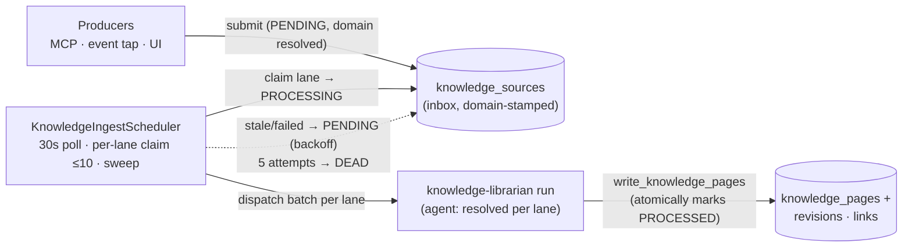

# Knowledge Center

The Knowledge Center is an LLM-maintained wiki for a project: an AI "librarian" reads inbound material
(Work Item status changes, merged GitHub PRs, manual notes, anything you submit) and files it into a
bundle of versioned Markdown pages with YAML frontmatter. Nobody hand-writes wiki pages — the librarian
creates and edits them; humans and other agents read them.

## Table of contents

- [Concept](#concept)
- [The ingestion envelope](#the-ingestion-envelope)
- [Producers](#producers)
- [The pipeline](#the-pipeline)
- [Page model](#page-model)
- [System workflows](#system-workflows)
- [Domains](#domains)
- [Retention](#retention)
- [MCP tools](#mcp-tools)
- [REST endpoints](#rest-endpoints)
- [Frontend surfaces](#frontend-surfaces)
- [Roadmap](#roadmap)

---

## Concept

Three layers, each with a different mutability:

| Layer | Mutability | What it is |
|---|---|---|
| Sources inbox (`knowledge_sources`) | Immutable, append-only | Raw inbound material — a Work Item status change, a merged PR, a manual note. Never edited, only claimed, marked processed, and eventually [retired by retention](#retention) once it's served its purpose. |
| Wiki pages (`knowledge_pages`) | Agent-owned, versioned | Markdown + YAML frontmatter, one file per page, `path` is identity. The librarian creates and edits these; the format is referred to in code as **OKF** (Markdown body + YAML frontmatter — no separate spec, just the convention this codebase follows). |
| `_schema.md` | Agent-authored style guide | A wiki page like any other, but read by the librarian as its own instructions: frontmatter contract, page-type taxonomy, path layout, per-type body templates (stable section structure per type; `architecture` pages are diagram-first with a C4-style Mermaid flowchart), create-vs-edit heuristics. Seeded on enable, then it's just another page an operator or the librarian can evolve. |

This is deliberately **not RAG** (retrieval over raw source chunks at query time). Sources are filed once,
at ingestion time, into durable, editable pages that get more accurate as the librarian revises them —
the wiki *compounds*: later sources correct or extend earlier pages instead of just piling up more chunks
to search over. Retrieval (`search_knowledge`, `read_knowledge_pages`) reads the compounded pages, not the
raw inbox.

---

## The ingestion envelope

Every unit of inbound material — regardless of producer — is a `KnowledgeSubmission` with the same shape:

| Field | Required | Description |
|---|---|---|
| `projectId` | yes | Target project. |
| `sourceType` | yes | Free-form producer tag, e.g. `conductor.work_item.status_changed`, `github.pr_merged`, `codebase.snapshot`. |
| `sourceRef` | one of `payload`/`sourceRef` | By-reference pointer (e.g. `github:owner/repo#123`) the librarian or a later adapter resolves. |
| `payload` | one of `payload`/`sourceRef` | By-value inline content (e.g. a JSON blob of the event). |
| `title`, `contentType`, `occurredAt`, `metadata` | no | Descriptive metadata carried through to the librarian's read. |
| `dedupKey` | no | Explicit idempotency key. When omitted, derived server-side from `projectId`+`sourceType`+`sourceRef`+`occurredAt` (SHA-256). |
| `origin` | server-derived | `{kind, id}` — who/what submitted it (`USER`, `API_KEY`, `EVENT_TAP`, `GITHUB_CONNECTOR`). Never accepted from the client; always derived from the caller's auth or the adapter's identity. |
| `domain` | no | Explicit [domain](#domains) slug to route into (validated against the ACTIVE registry; unknown/inactive is a 400). Omitted lets `KnowledgeDomainResolver` route by `sourceType` glob pattern instead; still unmatched falls to the null/generalist lane. Resolved once at submit time and stamped onto the row — never re-resolved later. |

**Idempotency.** Submission is claim-or-return on `(projectId, dedupKey)`: the first caller for a key
inserts the row (`ACCEPTED`); any later caller with the same key gets back the original row's id
(`DUPLICATE`) without inserting again. Safe to retry a submission blindly.

**64KB offload.** A `payload` over 64KB is uploaded to GCS (`StorageService`) and the row keeps only a
`payload_uri`; the `payload` column is left null. Reads resolve it transparently — `read_knowledge_sources`
downloads and inlines it, but a plain inbox browse (`listSources`) never triggers a download per row.

---

## Producers

All four are gated on the `knowledge_enabled` project setting (`project_settings.knowledge_enabled`,
default `false`) — nothing is ingested until it's turned on. As of this phase there's no dedicated
frontend settings page for it; toggle it via `PATCH /api/v1/projects/{projectId}/settings` with
`{"knowledgeEnabled": true}`.

| Producer | `sourceType` | Trigger |
|---|---|---|
| REST `POST /knowledge/sources` | caller-supplied | Any authenticated caller (user, project API key, or a run-scoped workflow MCP token) submits directly. |
| MCP `submit_knowledge_source` | caller-supplied | Same endpoint, called from Claude Code or a workflow's `claude-code` step. |
| Work Item status-change event tap (`KnowledgeEventTap`) | `conductor.work_item.status_changed` | Fourth consumer wired into `NotificationDispatcher.dispatch`, alongside workflow/lifecycle triggers. Its own try/catch — an ingestion failure never blocks notification delivery or trigger evaluation. |
| GitHub `pr_merged` adapter (`GitHubConnector`) | `github.pr_merged` | On a merged PR webhook, submits it as a source regardless of whether it references a Conductor Work Item — this is about the codebase, not one issue. |

---

## The pipeline

`KnowledgeIngestScheduler` polls every 30s, per **lane** — a lane is a [domain](#domains) slug, or `null`
for the generalist/unclassified lane; the concurrency unit is `(project, lane)`, not the whole project:

1. **Dispatch.** For each project with `knowledge_enabled` and any due `PENDING` source (`nextAttemptAt`
   null or past), the scheduler enumerates every lane with due work and, for each lane not already busy,
   claims up to 10 oldest sources *in that lane* into `PROCESSING` (`REQUIRES_NEW` transaction), then fires
   a `knowledge-librarian` run via `LibrarianDispatchService` — a `workflow_dispatch` trigger carrying
   `sourceIds` (comma-joined), `projectId`, `agentSlug`, and `domain` (`""` for the null lane) as top-level
   event-payload fields (`${{ event.sourceIds }}` etc.), not `workflow_dispatch` `inputs` (see
   [`docs/workflows.md`](workflows.md#outputs-and-interpolation) — `event.FIELD` resolves any trigger's
   stored payload). Multiple lanes can dispatch in the same tick — an in-flight engineering-domain batch
   never blocks a product-domain batch.
2. **Per-lane busy check, project-wide bootstrap block.** A lane is busy iff it currently has any
   `PROCESSING` source — busy lanes are skipped this tick without affecting any other lane (they
   self-serialize; a non-terminal `knowledge-librarian` run no longer blocks the whole project). The one
   project-wide block is `knowledge-bootstrap`: while it has a non-terminal run, no lane dispatches — it
   writes broadly across the wiki in one large operator-triggered run.
3. **Agent resolution.** `LibrarianDispatchService` resolves `agentSlug` per dispatch: the lane's domain
   row's `owningAgentSlug` if one is assigned and that agent still exists, else the generalist
   `knowledge-librarian` — a deleted specialist demotes its lane back to the generalist on the next
   dispatch rather than stranding it. `knowledge-librarian.yaml`'s `agent: ${{ event.agentSlug }}`
   resolves this per run (see [`docs/workflows.md`](workflows.md#outputs-and-interpolation) — `with.agent`
   now accepts `${{ }}` interpolation, same as `task`/`context`; a fixed literal agent slug in any other
   workflow still works unchanged).
4. **Librarian files the batch.** The dispatched agent step reads `_schema.md` (and, if `Domain` is
   non-empty, that domain's own `<domain>/_schema.md`) and `index.md` for orientation, reads the batch's
   sources, drafts page content, and writes every resulting page in **one** `write_knowledge_pages` call
   passing `sourceIds` — which atomically marks the batch `PROCESSED` in the same transaction as the page
   writes (`KnowledgeSourceRepository.markProcessed`, `flushAutomatically` + `clearAutomatically`, so a
   crash between the write and the mark can never happen). If no source in the batch warrants a wiki
   change, the librarian still calls `write_knowledge_pages` with `writes: []` and `sourceIds` set to the
   full batch — an explicit "no wiki change needed" ack, so the batch is marked `PROCESSED` instead of
   rotting through the stale-processing sweep into `DEAD`.
5. **Sweep.** Every tick, any source still `PROCESSING` whose run is missing, terminally
   failed/cancelled/timed-out, or has simply run longer than 30 minutes is resurrected: attempts++, back to
   `PENDING` with exponential backoff (`60s * 2^attempts`), or — at 5 attempts — `DEAD` with an error
   message. If the librarian workflow isn't provisioned yet, or its stored YAML has drifted from the
   current classpath template (e.g. a project enabled before per-lane `agent: ${{ event.agentSlug }}`
   shipped), dispatch self-heals via `KnowledgeWorkflowProvisioner.provision` (which refreshes drifted
   system-workflow YAML in place) before retrying; if that still fails, the claimed batch is released
   straight back to `PENDING` instead of being dispatched into a stale or missing target.

Source lifecycle: `PENDING → PROCESSING → PROCESSED` (success) or `PENDING → PROCESSING → PENDING`
(retried, backoff) `→ … → DEAD` (exhausted).

---

## Page model

- **`path` is identity.** Lowercase, hyphenated, `.md`-suffixed (`^[a-z0-9_][a-z0-9_/.-]*\.md$`), unique per
  project. `..` segments are rejected; `index.md` and `log.md` are reserved (see below).
- **Frontmatter contract.** Every page is Markdown with a leading `---`/`---` YAML block. `type` is the only
  *required* field — a page with none is rejected (422). `title`, `description`, `resource`, `tags`,
  `timestamp`, `confidence`, `sources` are recommended conventions (defined in `_schema.md`, not enforced by
  the parser); any other key round-trips verbatim so page-type-specific fields survive. Root `_schema.md`
  owns only `schema` and the cross-cutting `decision` type; every other type (`architecture`, `feature`,
  `person`, etc.) is owned by a [domain](#domains)'s own `<slug>/_schema.md` schema page, not the root.
- **Versioning + optimistic concurrency.** Every page has an integer `version`, starting at 1. A
  `write_knowledge_pages`/`batch-write` call supplies `baseVersion` per write: `null` means "I believe this
  path doesn't exist yet"; any other value must match the current stored version exactly. **The whole batch
  is all-or-nothing** — one stale write aborts every write in the call (nothing is persisted) and raises a
  409 carrying every conflicting path's `{path, currentVersion, currentContent}` (`currentContent` null when
  the path has no live page at all). The caller re-reads, merges, and retries once with the fresh version.
- **Revisions + provenance.** Every create/update/delete writes a full-content `knowledge_page_revisions`
  row (`CREATE`/`UPDATE`/`DELETE`) with an `Actor` (`kind`, `id`, `workflowRunId`) and, if the write's
  `sourceIds` were supplied, a `knowledge_revision_sources` link per source — so "what fed this edit" is
  queryable independent of the optional `sources` frontmatter field.
- **Link graph.** On every write, outgoing Markdown links (`[text](/dir/page.md)` or relative) are
  re-extracted from the body into `knowledge_links`, resolved against live pages where possible. A link to a
  page that doesn't exist yet is stored dangling and **re-resolved automatically** the moment that path is
  created (`resolveDangling`); deleting a page unresolves links that pointed at it.
- **Virtual pages.** `index.md` (every live page grouped by directory) and `log.md` (last 100 revisions
  grouped by day, with source refs) are generated on read, never stored — the librarian's two orientation
  reads. Both report `version: 0`.
- **Reserved paths.** `index.md`, `log.md` cannot be written to (400). A leading underscore is otherwise a
  normal path character (`_schema.md` is a real, editable page, not special-cased beyond being seeded).

---

## System workflows

Two automation workflows, plus the librarian's `Agent` definition, are provisioned by
`KnowledgeWorkflowProvisioner`, from the YAML templates in `conductor-backend/src/main/resources/knowledge/`.
Provisioning isn't a one-shot on the `false → true` transition: `ProjectSettingsService.updateSettings` calls
it on **every** settings save that leaves `knowledge_enabled` true, and `LibrarianDispatchService` calls it
just-in-time before firing a dispatch if it finds the workflow or the librarian `Agent` row missing. Both
paths are catch-up/self-heal — they cover a project enabled before a given artifact existed, and a seeded
artifact (most often the librarian `Agent`) that was deleted after the fact — coming back on the next
enabled settings save or the next scheduler tick, without an operator having to disable/re-enable. They're
identified purely by reserved workflow name / agent slug (no schema-level "system" flag); every call is
idempotent (upsert-if-missing) so any number of callers racing or repeating never duplicates rows. See
[`docs/workflows.md`](workflows.md#system-managed-workflows) for how they fit the general workflow model.

| Workflow | Trigger | Purpose |
|---|---|---|
| `knowledge-librarian` | `workflow_dispatch`, fired programmatically by `LibrarianDispatchService` — never by a human | A thin `uses: agent` step, `agent: ${{ event.agentSlug }}` resolved per dispatch (see [The pipeline](#the-pipeline)) — the seeded generalist `knowledge-librarian` Agent, or a domain's assigned specialist. Files one batch of claimed sources (one lane's worth) into pages. |
| `knowledge-bootstrap` | `workflow_dispatch` with a required `repo` input (`owner/repo`) | Operator-triggered once, to seed the wiki (`engineering/architecture/*.md`, `product/features/*.md`) from an existing codebase by cloning and reading it. A raw `claude-code` step (no agent involved). |

Both are **system-owned, canonical content**: `KnowledgeWorkflowProvisioner.provision` refreshes a
project's stored workflow YAML in place if it's drifted from the current classpath template (unlike the
wiki schema pages below, which are seed-if-absent only, since those are agent/user-editable).

**The librarian is an `Agent` definition, not a hardcoded prompt.** `KnowledgeWorkflowProvisioner` seeds a
project-scoped `knowledge-librarian` Agent (slug `knowledge-librarian`, provider `claude`, the filing
procedure from `knowledge/librarian-system-prompt.md` as its system prompt, bound to the four
`knowledge:*` tools — see [MCP tools](#mcp-tools) — with `configJson: {"maxToolTurns": 40}`) the same way
it seeds the workflow YAML. The system prompt, model, and tool bindings are all editable afterward under
**Automation → Agents**, same as any other agent — evolving the librarian's behavior no longer requires a
backend change. Its **runtime** (which engine actually executes a run) is decoupled from this definition
entirely and resolves fresh on every dispatch — see
[Runtimes](workflows.md#agent--run-an-ai-agent) in the workflows doc: an explicit `runtime` key in the
agent's `configJson` pins it, otherwise it auto-detects from the project's credentials (a Claude Code
subscription credential is preferred over a `claude` API key when both are configured). Switching which
runtime the librarian runs on is therefore an Agents change, not a workflow edit.

**Operator prerequisites** before either workflow can run — either credential option works for the
librarian; `knowledge-bootstrap` is subscription-only:

- **`knowledge-librarian`**: either the project's **Claude Code (subscription)** credential or a `claude`
  provider API key (**Settings → AI Providers**) — subscription preferred when both are configured. No
  further setup is needed for the `claude-code` runtime's Conductor MCP access — the backend mints a
  short-lived, run-scoped token automatically (see [`docs/workflows.md`](workflows.md)).
- **`knowledge-bootstrap`**: the project's **Claude Code (subscription)** credential (subscription-only —
  it's a raw `claude-code` step, **Settings → AI Providers**), plus a **`GITHUB_TOKEN`** workflow secret
  (**Settings → Workflows → Secrets**) with read access to the target repo, for cloning a private repo.
  Unset works fine for a public repo (the token segment interpolates to empty and `git clone` proceeds
  unauthenticated).

---

## Domains

A **domain** is a top-level wiki area (`engineering/`, `product/`, `marketing/`, `finance/`, `people/` by
default) with its own registry row (`knowledge_domains`, `KnowledgeDomain`/`KnowledgeDomainRepository`)
and its own `<slug>/_schema.md` schema page defining that area's page-type taxonomy, path layout, and
body templates. The root `_schema.md` covers only the frontmatter contract, linking, create-vs-edit, and
the cross-cutting `decision` type — everything else is domain-owned (see [Page model](#page-model)).
`KnowledgeWorkflowProvisioner` seeds all five on enable, the same idempotent guard-then-insert pattern as
the system workflows/schema page.

**Resolution precedence**, run once per submission by `KnowledgeDomainResolver` and stamped onto the
source (never re-resolved later, even if the registry changes afterward):

1. **Explicit caller `domain`** — validated against the project's `ACTIVE` registry; an unknown or
   non-`ACTIVE` slug is rejected (400), not silently dropped or redirected.
2. **First `ACTIVE` domain (slug order) whose `sourceTypePatterns` glob-matches `sourceType`** — `*` is a
   wildcard, everything else is matched literally. Seeded default: `engineering` claims `github.*`; every
   other seeded domain starts with no patterns (PATCH-able per project — see below). Slug order makes
   overlapping globs deterministic.
3. **`null`** — the generalist/unclassified lane. Never strands a source: a domain dismissed or deleted
   after a source was stamped just means dispatch re-resolves the *agent* (not the domain) at claim time,
   falling back to the generalist librarian.

**Lane concurrency** is `(project, domain)` — see [The pipeline](#the-pipeline) for how the scheduler
dispatches and busy-checks each lane independently.

**Registry fields** (`KnowledgeDomainDto`): `slug`, `displayName`, `description`, `pathPrefix`,
`schemaPagePath`, `sourceTypePatterns`, `owningAgentSlug` (nullable — the specialist agent dispatch
resolves to, if assigned; un-FK'd, since agents are deletable and dispatch just falls back), `state`
(`ACTIVE`/`SUGGESTED`/`DISMISSED` — `SUGGESTED`/`DISMISSED` are reserved for a future gap-report workflow
where the librarian raises a suggested domain, not yet wired up), `suggestionReason`, and live
`pendingCount`/`processingCount`/`processedCount` from the ingestion inbox. `PATCH /knowledge/domains/{slug}`
(ADMIN-only) edits
`displayName`/`description`/`sourceTypePatterns`/`state` with standard partial-PATCH semantics (omit a
field to leave it unchanged); `owningAgentSlug` assignment/clearing is a discriminated pair
(`owningAgentSlug` to assign, `clearOwningAgent: true` to clear) rather than a plain nullable field, since
a request body has no wire-level way to distinguish an omitted field from an explicit `null` for just one
field in an otherwise-partial PATCH.

Creating a specialist agent for a domain (`owningAgentSlug` assignment via a dedicated endpoint) and
librarian-raised gap reports (the `SUGGESTED` state) are not yet implemented — reserved for a later phase.

---

## Retention

The ingestion inbox (`knowledge_sources`) is append-only by design (see [Concept](#concept)), but that
doesn't mean it grows forever: once a source's payload has served its purpose, keeping the raw content
around indefinitely is pure bloat -- the compounded wiki pages are the durable record, not the inbox.
`KnowledgeRetentionService` runs an hourly sweep with two independent, batch-bounded passes:

| Sweep | Scope | Effect |
|---|---|---|
| **Compact** | `PROCESSED` sources older than `processed-days` (default **30**) | Deletes any offloaded GCS object (`payload_uri`) *first*; only once that succeeds does it null the inline `payload` column and `payload_uri`, then stamp `purged_at`. The row itself -- id, type, ref, metadata, status, timestamps -- is kept, since `knowledge_revision_sources` still references it by id and the wiki's [Log view](#page-model) surfaces source refs by id. Only the (potentially large) payload content is reclaimed. |
| **Delete** | `DEAD` sources older than `dead-days` (default **90**) | Same GCS-first rule, then hard-deletes the row entirely. A `DEAD` source exhausted every retry ([the pipeline](#the-pipeline)'s sweep) without ever being marked `PROCESSED`, so it normally has no downstream references — but a librarian run that outlived the stale window can still link a revision to a source *after* it was dead-lettered, so each row is checked first and a provenance-referenced `DEAD` source is compacted into a tombstone (payload purged, row kept) instead of deleted. |

Each pass processes at most one batch (100 rows) per tick and commits each row's compaction/deletion in
its own transaction, so a large backlog never holds a long-running transaction or blocks the hourly tick.
**A failed GCS delete skips the row entirely** rather than nulling `payload_uri` anyway -- the row is left
untouched and retried on the next hourly tick, so `payload_uri` is never cleared unless the object it
points at is confirmed gone. The alternative (purge the row regardless) would leave that object sitting
in the bucket with nothing left to ever reference or clean it up.

**Configuration** (both accept a day count):

| Property | Env var | Default |
|---|---|---|
| `conductor.knowledge.retention.processed-days` | `KNOWLEDGE_RETENTION_PROCESSED_DAYS` | `30` |
| `conductor.knowledge.retention.dead-days` | `KNOWLEDGE_RETENTION_DEAD_DAYS` | `90` |

**Visibility.** `purgedAt` is exposed on every source read surface -- the `GET /sources` REST endpoint's
`KnowledgeSourceDto`, and the `read_knowledge_sources` MCP tool / agent tool's result -- so a caller can
tell whether a `PROCESSED` source's payload is still available (`purgedAt: null`) or has already been
compacted (`purgedAt` set; `payload`/`payloadOffloaded` will read back empty).

---

## MCP tools

Five tools in `conductor-tools` (`src/mcp/tools/knowledge.ts`), used by the librarian/bootstrap workflows
and available to any Claude Code session with the Conductor MCP server configured:

| Tool | Purpose |
|---|---|
| `submit_knowledge_source` | Push one source into the inbox. Idempotent on `dedupKey`; `DUPLICATE` status is not an error. Optional `domain` requests an explicit [domain](#domains) lane (validated); omitted lets the registry route by `sourceType` pattern. |
| `read_knowledge_sources` | Fetch inbox sources by id, with offloaded payloads resolved inline. |
| `search_knowledge` | Full-text search over pages — path, type, title, description, snippet, rank. Orientation before reading. |
| `read_knowledge_pages` | Fetch full page content by path. `["index.md"]`/`["log.md"]` return the virtual orientation pages. Returned `version` feeds `baseVersion` on the next write. |
| `write_knowledge_pages` | Atomic batch create/update/delete; `writes` may be empty when `sourceIds` is set, to ack a batch that needs no page changes. A stale write returns a structured `{conflict: true, conflicts: [...]}` result instead of throwing, per [MCP tool guidelines](mcp-tool-guidelines.md) — merge and retry once. |

The same four operations back an `agent`-tool source (`knowledge:read_knowledge_pages`, etc. —
`KnowledgeToolProvider`) so any project agent, not just the librarian, can be bound to them under
**Automation → Agents**. Bare tool names match across both surfaces on purpose — one system prompt works
whether the agent runs the `api` runtime (calling this provider directly) or the `claude-code` runtime
(calling the equivalent `mcp__conductor__*` MCP tool). Both are gated on `knowledge_enabled`.

---

## REST endpoints

All under `/api/v1/projects/{projectId}/knowledge/`, accepting a user session (project membership via
`ProjectSecurityService`), a project-scoped API key, or a run-scoped workflow MCP token (both the latter
are `ProjectScopedPrincipal` — see [`docs/workflows.md`](workflows.md)):

| Method | Path | Purpose |
|---|---|---|
| `POST` | `/sources` | Submit a source. `202` with `{sourceId, status}`. Optional `domain` requests an explicit lane. |
| `GET` | `/sources` | List by `status` (default `PENDING`), optionally filtered by `domain` (exact match), or multi-get via `ids` (`ids` wins over both filters). |
| `GET` | `/sources/counts` | Per-status inbox counts (`pending`/`processing`/`processed`/`dead`), zero-defaulted — the cheap summary the frontend's pipeline strip polls instead of a full `listSources` per status. |
| `GET` | `/domains` | List the [domain](#domains) registry, slug-ordered, each with live pending/processing/processed counts. Membership-gated, no admin requirement. |
| `PATCH` | `/domains/{slug}` | Update a domain's metadata, owning agent, or state. ADMIN-only. |
| `POST` | `/pages/batch-write` | Atomic create/update/delete batch. `200` on success; `409` with a `conflicts` extension on a concurrency race; `422` on malformed frontmatter. |
| `GET` | `/pages?paths=` | Multi-get full page content by comma-separated paths. Unknown/deleted paths silently omitted. |
| `GET` | `/index` | The generated virtual `index.md`. |
| `GET` | `/search?q=` | Full-text search; optional `type`, `pathPrefix`, `limit` (default 20). |
| `GET` | `/revisions?path=` | Revision history for one page, newest first, with actor + source provenance. |

---

## Frontend surfaces

- **Connect Claude hint.** The Knowledge index page's empty state (admins only) no longer shows the old
  multi-row checklist (Claude credential + project API key row) — a single `listProviderCredentialStatuses`
  call checks Claude connectivity directly (`claude-code` subscription or a `claude` provider API key); the
  project-API-key row is gone entirely, since Conductor MCP access no longer needs one (see
  [`docs/workflows.md`](workflows.md)). Connected: just the `Enable Knowledge` action. Not connected: a
  hint links to **Settings → AI Providers** to connect one. Guidance, not a gate — `Enable Knowledge` stays
  clickable regardless of connection state, since the pipeline self-heals (see
  [System workflows](#system-workflows)).
- **Pipeline strip.** Once the wiki has content, the index page shows a one-line summary above it:
  pending/dead inbox counts (linking to the source list below), the librarian's last run status, and a
  link to the librarian `Agent`. Best-effort and auxiliary — a fetch failure renders nothing rather than
  breaking the wiki page.
- **Source list.** `knowledge/sources` is a read-only, status-filtered browse of the ingestion inbox
  (`GET /sources`) — no actions; the scheduler and librarian own the lifecycle. Rows show the domain
  lane as a small badge next to the source-type badge when the source was routed to one (nothing shown
  for the null/generalist lane).
- **Default agent chip.** The Agents list, an agent's detail header, and `AgentResponse.isDefault`
  together surface which agents (e.g. the librarian) are seeded by Conductor rather than user-created.
  Deleting one is allowed — the chip's tooltip says it will be recreated. The librarian's Overview tab
  also cross-links to its workflow's Runs tab.

---

## Roadmap

Deliberately deferred out of this phase:

- **Domain specialists + gap reports** — creating a specialist agent for a domain
  (`owningAgentSlug` assignment via a dedicated endpoint) and librarian-raised gap reports (the
  `SUGGESTED` registry state) are designed but not yet implemented; see [Domains](#domains).
- **Domains overview UI** — the registry is API/MCP-only so far; no frontend panel yet.
- **Lint workflow** — a scheduled pass that checks the wiki against `_schema.md`'s own conventions (broken
  links, missing recommended frontmatter, orphaned pages) and files findings back into the inbox.
- **Human editing** — the frontend wiki browser is read-only; writing a page today means the librarian, or
  a direct API/MCP call, not an in-app editor.
- **Review-gated edits** — a human-approval step before a librarian write lands, for higher-stakes pages.
- **Embeddings / semantic search** — search is Postgres full-text (`tsvector`/GIN) only; no vector index.
- **Pub/Sub-driven ingestion** — the scheduler is poll-based (30s); no push-triggered dispatch yet.
