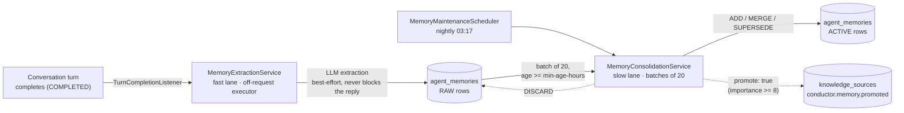

# Agent Memory

Agent memory (`agent_memories`) is a workspace-scoped store of durable facts, decisions, preferences,
and events that agents accumulate across conversations — distinct from `agent_runs` (per-turn
transcripts, ephemeral) and from the [Knowledge Center](knowledge.md) (`knowledge_pages`, the
human-facing wiki). Nobody writes memories directly in the normal case: a fast, per-turn extraction
pass captures raw candidates, and a nightly consolidation pass decides which become durable.

## Table of contents

- [Concept](#concept)
- [Memory vs. Knowledge](#memory-vs-knowledge)
- [The write path](#the-write-path)
- [Retrieval and scoring](#retrieval-and-scoring)
- [Bi-temporal lifecycle](#bi-temporal-lifecycle)
- [Retention](#retention)
- [The MemoryRetriever SPI](#the-memoryretriever-spi)
- [Configuration](#configuration)
- [The search_memory agent tool](#the-search_memory-agent-tool)
- [REST endpoints](#rest-endpoints)
- [Frontend surface](#frontend-surface)

---

## Concept

A memory is one `agent_memories` row: `content` (free text, ≤2000 chars via the REST API, ≤500 chars
for an extracted candidate), a `memory_type` (`fact` / `decision` / `preference` / `event`), an
`importance` (1–10), and a bi-temporal validity window (`valid_from`/`valid_to`). A row is **live** iff
`valid_to IS NULL`, regardless of its stored `status` (`RAW` or `ACTIVE` — see
[Bi-temporal lifecycle](#bi-temporal-lifecycle)). Content is never mutated in place once a memory
carries meaning others may already be relying on — closing a row and inserting its replacement is the
only way a memory changes, so the chain from any row back through everything it replaced stays
reconstructible.

## Memory vs. Knowledge

Both are wiki-adjacent, LLM-maintained stores, but they answer different questions and decay
differently:

| | Memory | Knowledge |
|---|---|---|
| Question it answers | *What should an agent remember about this workspace's people, decisions, and preferences?* | *What should the org know — architecture, features, integrations?* |
| Audience | Agents, injected into their own context | Humans and agents, read as documentation |
| Source | Conversation turns (fast-lane extraction) | Work Items, merged PRs, manual submissions, metrics digests |
| Editability | Never mutated in place — superseded, not edited (except a human's direct REST edit) | Librarian-edited pages, versioned, revisable in place |
| Decay | Yes — low-importance rows age out and get purged (see [Retention](#retention)) | No built-in decay — pages persist until a human or the librarian removes them |
| Retrieval | Full-text search + recency/importance scoring, always through [`MemoryRetriever`](#the-memoryretriever-spi) | Full-text search over compounded pages |

**Promotion is the seam between them.** When the nightly consolidation pass judges a raw candidate a
stable, org-relevant fact or decision (importance ≥ 8), it also sets `promote: true`. The resulting
`ACTIVE` memory is submitted into the Knowledge Center's ordinary ingestion inbox as a
`conductor.memory.promoted` source (see [Producers](knowledge.md#producers)) — from there it's just
another source the librarian reads and may (or may not) file into a page, same as a completed Work Item
or a merged PR. `agent_memories.promoted_at` is stamped once the submission succeeds, so a memory can be
both a live memory *and* the seed of a wiki page — the two stores aren't mutually exclusive.

---

## The write path

Memory is written by a **dual-phase** pipeline: a fast, per-turn extraction pass that never blocks a
conversation reply, and a slow, nightly consolidation pass that has the benefit of neighboring memories
(and optionally the knowledge base) as context before committing to something durable.



**Fast lane — `MemoryExtractionService`.** Registered as a `TurnCompletionListener`, fired by
`AgentConversationRunner` after a turn persists as `COMPLETED` (never for a failed turn). To keep this
off the request path entirely, the listener only validates cheap flags/heuristics inline (feature flags,
a 200-char combined-length floor below which a turn is assumed too thin to contain anything durable) and
submits the actual LLM call to a small, dedicated `memoryExtractionExecutor` pool — separate from the
conversation executor, so extraction latency or a provider outage can never slow down or fail a reply.
The extraction prompt asks for a JSON array of `{content, type, importance}` candidates (`[]` if nothing
is worth remembering); parsing is defensive (tolerates prose/markdown fences around the array, caps at 5
candidates, clamps importance to 1–10, falls back to `fact` for an unrecognized type) and never throws.
Every candidate lands as a `RAW` row via `MemoryService.createRaw`, attributed to the acting agent and
source conversation. Every failure mode (missing agent, unknown provider, no credential, unparseable
response) is logged and dropped — nothing is waiting on this result.

**Slow lane — `MemoryConsolidationService`.** Runs once nightly per `MemoryMaintenanceScheduler`
(cron `0 17 3 * * *`), one project at a time, isolated per-project try/catch. For each project with a
resolvable CEO agent (same provider/model/credential the conversation stack already uses), it drains up
to 5 batches of 20 `RAW` rows at least `min-age-hours` old. Each batch gets one LLM call whose payload
includes, per raw item, its own content plus up to 5 live `ACTIVE` neighbor memories (via
`MemoryRetriever`, so consolidation reuses the same relevance/recency/importance ranking retrieval
does) and, if the project has Knowledge enabled, up to 3 relevant knowledge-page excerpts — so the model
can recognize "this is already documented" and discard rather than duplicate. The model returns one
decision per raw item:

| Action | Effect |
|---|---|
| `ADD` | Promote the raw row to `ACTIVE` as-is or lightly rewritten. |
| `MERGE` | Fold the raw row into an existing `targetId` memory — `MemoryService.supersede` closes the target and inserts the merged replacement; the raw row is deleted (it isn't itself a supersession, it's folded away). |
| `SUPERSEDE` | The raw row replaces/outdates `targetId` — the raw row itself becomes the `ACTIVE` replacement; `MemoryService.closeAndLink` closes the target and points its `supersededBy` at the raw row's id. |
| `DISCARD` | Not durable, a duplicate, or already documented in the knowledge excerpts — the raw row is deleted. |

Every raw row in a processed batch is guaranteed to leave `RAW` eventually. A parse failure, an unknown
action, or a `targetId` that doesn't resolve to a live `ACTIVE` row (including a second decision in the
same batch trying to claim a target another decision already closed) leaves that row **unresolved**:
`consolidation_attempts` increments and it's retried on a later tick. At 5 attempts, it fail-safe
promotes to `ACTIVE` as-is — the pipeline must never wedge on a row the model can't resolve, and must
never silently drop it either. A `promote: true` decision (reserved for importance ≥ 8 stable,
org-relevant facts/decisions) queues the resulting `ACTIVE` row for [promotion](#memory-vs-knowledge) to
the knowledge inbox, submitted outside the batch's own transaction so a knowledge-service hiccup can
never roll back memory state that was otherwise successfully consolidated.

---

## Retrieval and scoring

Every retrieval path — the conversation augmentor, the `search_memory` tool, and consolidation's own
neighbor lookup — goes through the same [`MemoryRetriever`](#the-memoryretriever-spi), never a direct
repository query, so ranking strategy stays swappable in one place.

`FtsMemoryRetriever` (the only implementation today) blends two candidate pools so a query that matches
nothing on text still surfaces the project's most salient memories rather than an empty result:

1. **Full-text search** — up to 50 candidates via Postgres `tsvector`/GIN, `ts_rank`-scored. The query
   text is tokenized and **OR-joined** (deliberately not a plain `websearch_to_tsquery`, which ANDs bare
   terms — passing a whole chat message or memory sentence that way would require every word to match
   and return nothing for realistic queries): distinct tokens of at least 4 characters, longest 12 kept.
2. **Importance/recency floor** — the 20 live memories with the highest `importance`, most-recent first,
   regardless of text match.

Both pools are merged, then every candidate is scored:

```
score = (relevance + recency + importanceNorm) / 3
```

- **relevance** — `ts_rank / maxRank` in the candidate set (0 if nothing matched on text).
- **recency** — exponential decay with a **7-day half-life**, from `last_accessed_at` (or `valid_from`
  if never accessed).
- **importanceNorm** — the author-assigned 1–10 importance, normalized to 0–1.

The three are averaged unweighted — deliberately simple until real usage data justifies tuning weights.
Any memory actually surfaced to a caller (the augmentor's system-prompt addendum, or a `search_memory`
result) has its `access_count`/`last_accessed_at` bumped, which is what makes recency reflect *use*, not
just age.

**How agents see it.** `DatabaseMemoryAugmentor` (the one `MemoryAugmentor` implementation — see
[`docs/conversations.md`](conversations.md#the-conversation-bounded-context)) retrieves up to 8 scored
memories per turn and renders them into a `## Long-term memory` **system-prompt addendum** — never into
the message window itself, so memory context doesn't masquerade as something the user or agent actually
said. The addendum is budget-capped at 1,800 characters (an "(N more omitted for space)" line if the cap
truncates the list) and explicitly frames memories as "may be stale — the live conversation takes
precedence; the knowledge base is the authoritative source for documentation."

---

## Bi-temporal lifecycle

| Field | Meaning |
|---|---|
| `status` | `RAW` (agent-authored, unreviewed extraction) or `ACTIVE` (durable — created directly by a human, or promoted from `RAW` by consolidation). **Not** a full lifecycle enum — see below. |
| `valid_from` / `valid_to` | The row's validity window. Live iff `valid_to IS NULL`. |
| `superseded_by` | Set when this row was closed by a replacement — points at the new row's id. `ON DELETE SET NULL`, so purging an old closed row can never break a still-live row's chain. |

The REST/frontend-facing **`status`** you see on a `MemoryView` (`raw` / `active` / `superseded`) is a
**derived tri-state**, not the stored entity status: a closed row (`valid_to` set) always reports
`superseded`, regardless of which of `RAW`/`ACTIVE` it carried before closing. A closed row is
read-only history — `PATCH` on it 409s.

Every path that closes a live row and creates its replacement in the same operation
(`MemoryService.supersede`) keeps the chain intact atomically; `MemoryService.history(projectId, id)`
walks that chain backwards (each ancestor is the row whose `superseded_by` equals the current cursor),
newest-first, capped at depth 10 — this is what backs a `MemoryDetailView`'s `history` array in the
[Frontend surface](#frontend-surface).

---

## Retention

`MemoryMaintenanceScheduler` runs two independent, batch-bounded passes after each nightly consolidation
tick (batches of 100, capped at 50 iterations per pass per tick, per-row `REQUIRES_NEW` + try/catch so
one bad row never blocks the rest):

| Pass | Scope | Effect |
|---|---|---|
| **Close** | Live rows (`valid_to IS NULL`) with `importance <= 3` untouched (accessed or created) in `stale-days` days | Closes the validity window. No `superseded_by` is set — this is aging out, not a replacement. |
| **Purge** | Rows closed (any reason — supersession, manual close, or the close pass above) more than `purge-closed-days` days ago | Hard-deletes the row. |

---

## The MemoryRetriever SPI

```java
public interface MemoryRetriever {
    List<ScoredMemory> retrieve(String projectId, String query, int limit);
    record ScoredMemory(AgentMemory memory, double score, double relevance, double recency) {}
}
```

`FtsMemoryRetriever` (Postgres full-text search, see [Retrieval and scoring](#retrieval-and-scoring)) is
the only implementation today. This is the deliberate seam for a future **pgvector/hybrid retriever** —
every consumer (the augmentor, `search_memory`, consolidation's neighbor lookup) already depends on the
interface, never on `AgentMemoryRepository`'s search methods directly, so swapping or blending in
semantic search later is a new `MemoryRetriever` bean, not a call-site migration. **Non-goal for this
phase:** there is no embedding column, no vector index, and no semantic similarity search — full-text
is it.

---

## Configuration

| Property | Default | Purpose |
|---|---|---|
| `conductor.memory.enabled` | `true` | Master switch for the **read path** and fast-lane extraction: gates `DatabaseMemoryAugmentor` (system-prompt injection), `MemoryExtractionService` (post-turn extraction), and the `search_memory` agent tool. Does **not** gate nightly consolidation/retention — that's `conductor.memory.maintenance.enabled` alone, so a project can keep consolidating/retiring existing memories with the read/write-new-memories surface turned off. |
| `conductor.memory.extraction.enabled` | `true` | Independently disables just the fast-lane per-turn extraction call, leaving retrieval/augmentation active. |
| `conductor.memory.maintenance.enabled` | `true` | Enables the nightly `MemoryMaintenanceScheduler` tick (consolidation + both retention passes), cron `0 17 3 * * *` (03:17 daily). |
| `conductor.memory.consolidation.min-age-hours` | `24` | A `RAW` row must be at least this old before a consolidation batch picks it up — gives it time to accumulate neighbors/context. |
| `conductor.memory.retention.stale-days` | `90` | See the Close pass in [Retention](#retention). |
| `conductor.memory.retention.purge-closed-days` | `90` | See the Purge pass in [Retention](#retention). |

---

## The search_memory agent tool

`MemoryToolProvider` (tool source `memory`) exposes one read-only tool, gated on
`conductor.memory.enabled`, mirroring `KnowledgeToolProvider`'s shape:

| Tool | Purpose |
|---|---|
| `search_memory` | `{q, limit?}` (default 8, max 20) — full-text search via `MemoryRetriever`, returning scored rows (`id, content, type, status, importance, agentId, createdAt, score`). Bumps `access_count`/`last_accessed_at` on every returned memory. |

No Conductor MCP twin exists in v1 — memory is reachable only via the `api` runtime today (same
convention `CoordinatorToolProvider` uses for `ask_agent` and friends), so `AgentToolProvider`'s default
`Optional.empty()` `claudeCodeToolName` already gives the correct answer. The seeded **CEO agent** is
backfilled with `memory:search_memory` by `CoordinatorProvisioner` — read-only, same rationale as its
knowledge tools: the CEO can search long-term memory, but extraction/consolidation stay a background
pipeline concern, never something a conversation triggers directly.

---

## REST endpoints

All under `/api/v1/projects/{projectId}/memories`, accepting a user session or a project-scoped API key
(`ProjectSecurityService`), no admin requirement:

| Method | Path | Purpose |
|---|---|---|
| `GET` | `/memories` | List, filtered by `q` (full-text), `status` (`raw`/`active`/`superseded`), `type`, `agentId`; paginated (`limit` default 50 max 200, `offset`). Returns `{items, total}`. |
| `GET` | `/memories/counts` | `{liveTotal, raw, consolidated, superseded}` — the cheap summary for a UI badge. |
| `POST` | `/memories` | Human-authored memory — lands `ACTIVE` immediately (no consolidation pass), `agentId`/`sourceConversationId` null. `{content, type, importance?}` → `201`. |
| `GET` | `/memories/{memoryId}` | One memory plus its supersession `history` (newest first, see [Bi-temporal lifecycle](#bi-temporal-lifecycle)). |
| `PATCH` | `/memories/{memoryId}` | All-optional partial update (`content?`, `type?`, `importance?`). `409` if the memory is already superseded — a closed row is history, not a live document. |
| `DELETE` | `/memories/{memoryId}` | Hard-delete. `204`. |

This surface is a UI/API **lens** over `MemoryService` only — it never triggers extraction or
consolidation itself; those stay pipeline-driven (see [The write path](#the-write-path)).

---

## Frontend surface

**Memory** (`memory/`, sidebar entry alongside Docs and Knowledge). A single page — simpler than
Knowledge's rail-based IA, since there's no schema/curation/domain layer here, just a filtered list plus
a detail view:

- **Header** — title, a one-line description, and a counts summary from `/memories/counts` (e.g. "42
  memories · 3 awaiting consolidation · 1 superseded"), plus an **Add memory** action.
- **Controls** — a debounced (400ms, 2+ characters) full-text search box, a status filter (All / Raw /
  Active / Superseded), and a type filter (All / Fact / Decision / Preference / Event).
- **List** — content (2-line clamp, muted when superseded), a type chip, a `StatusBadge` for the
  derived status (`raw` reads amber "Awaiting consolidation", `active` green, `superseded` slate/muted
  — see the status ramp in [`docs/design-system.md`](design-system.md#status-ramp)), importance,
  a source-agent chip when `agentId` is set, a "Promoted to Knowledge" indicator when `promotedAt` is
  set, and a relative created date. "Load more" pages through beyond the 50-row default.
- **Detail** (a `Sheet` side panel) — full content and metadata, the supersession **history** timeline
  (from the detail endpoint's `history`), and **Edit**/**Delete** actions. Edit is disabled with an
  explanatory note on a superseded row (mirrors the backend's `409`).
- **Add memory** dialog — content, type, importance (default 5).

---

See also [`docs/conversations.md`](conversations.md) for how the augmentor and the fast-lane extraction
hook fit into a conversation turn, and [`docs/knowledge.md`](knowledge.md) for the promotion target and
the wiki's own ingestion pipeline.
