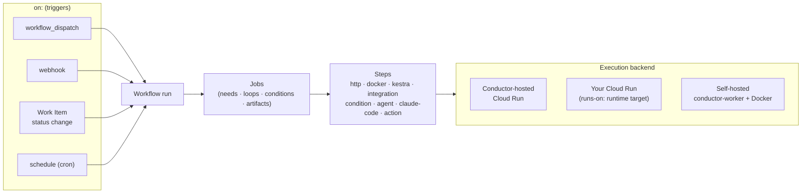

# Workflows

Workflows let you automate work that happens around your Conductor project — running scripts, calling APIs, triggering deploys, or orchestrating multi-step pipelines — in response to events like issue status changes, webhooks, cron schedules, or manual triggers.

## Table of contents

- [How workflows work](#how-workflows-work)
  - [Workflow file format](#workflow-file-format)
  - [Triggers](#triggers)
  - [Jobs](#jobs)
  - [Steps](#steps)
  - [Step types](#step-types)
  - [Outputs and interpolation](#outputs-and-interpolation)
  - [Artifacts](#artifacts)
  - [Loops](#loops)
  - [Conditions](#conditions)
  - [Example: monthly SEO analysis](#example-monthly-seo-analysis)
- [Execution modes](#execution-modes)
  - [Conductor-hosted](#conductor-hosted)
  - [Self-hosted](#self-hosted)
  - [Cloud Run](#cloud-run)
  - [Runtime targets (bring your own Cloud Run)](#runtime-targets-bring-your-own-cloud-run)
- [System-managed workflows](#system-managed-workflows)
- [Self-hosted setup](#self-hosted-setup)
  - [Prerequisites](#prerequisites)
  - [Running the daemon](#running-the-daemon)
  - [Subscription auth for claude-code steps](#subscription-auth-for-claude-code-steps)
  - [Runner image](#runner-image)
  - [Concurrency and capacity](#concurrency-and-capacity)
  - [Configuration reference](#configuration-reference)

---

## How workflows work



### Workflow file format

Workflows are defined in YAML. Every workflow has two required top-level keys: `on` (triggers) and `jobs`.

```yaml
on:
  workflow_dispatch: {}        # can be triggered manually from the UI

jobs:
  greet:
    steps:
      - name: say hello
        type: http
        method: POST
        url: https://hooks.example.com/notify
        body: '{"text": "Hello from Conductor!"}'
```

An optional `concurrency` key can be set to `"single"` to ensure only one run of the workflow is active at a time (useful for scheduled jobs):

```yaml
concurrency: single
```

---

### Triggers

The `on` block defines what starts the workflow. Multiple triggers can be combined.

#### Manual dispatch

Adds a **Run Now** button in the workflow UI.

```yaml
on:
  workflow_dispatch: {}
```

Optionally declare named inputs the caller must/may supply. Each is a `name: {description?, required?}`
entry, GitHub-Actions-style:

```yaml
on:
  workflow_dispatch:
    inputs:
      environment:
        description: Target environment
        required: true
      dry_run:
        description: Skip the deploy step
        required: false
```

A manual run passes values in the dispatch request body's `inputs` map (also how `dispatch_workflow`
and the **Run Now** UI pass them):

```json
{ "inputs": { "environment": "production", "dry_run": "false" } }
```

Reference them anywhere with `${{ inputs.environment }}`. `inputs:` is declarative only — it isn't
enforced at dispatch time (an omitted or extra key doesn't fail the run); referencing an
undeclared input produces a publish-time lint warning (see [Outputs and interpolation](#outputs-and-interpolation)).

#### Webhook

A unique webhook URL is generated per workflow. POST to it from any external service (GitHub Actions, Zapier, etc.) to trigger a run. The request body is available as `${{ event.* }}` during the run — the same `${{ event.FIELD }}` expression every trigger type populates (see [Outputs and interpolation](#outputs-and-interpolation)), not something specific to webhooks.

```yaml
on:
  webhook: {}
```

#### Work Item status change

Fires when any Work Item in the project changes status. Use `filters.status` to narrow it to a specific target status.

```yaml
on:
  conductor.work_item.status_changed:
    filters:
      status: "IN_REVIEW"     # only fire when a Work Item moves to IN_REVIEW
```

Available event fields: `event.toStatus`, `event.fromStatus`, `event.workItemId`.

#### Cron schedule

Runs on a recurring schedule using standard 5-field cron syntax.

```yaml
on:
  schedule:
    cron: "0 9 * * 1"         # every Monday at 9 AM UTC
```

| Field | Values |
|-------|--------|
| Minute | 0–59 |
| Hour | 0–23 |
| Day of month | 1–31 |
| Month | 1–12 |
| Day of week | 0–7 (0 and 7 = Sunday) |

Combine with `concurrency: single` to skip a scheduled run if a previous one is still running.

---

### Jobs

Jobs are the building blocks of a workflow. Each job runs independently and can depend on other jobs finishing first.

```yaml
jobs:
  fetch-data:
    steps: [ ... ]

  process-data:
    needs: fetch-data          # waits for fetch-data to succeed
    steps: [ ... ]

  notify:
    needs: [fetch-data, process-data]   # waits for both
    steps: [ ... ]
```

#### Job fields

| Field | Description |
|-------|-------------|
| `needs` | Job ID or list of job IDs this job depends on. The job runs only after all listed jobs succeed. |
| `runs-on` | Execution mode: `conductor` (default), `self-hosted`, `cloud-run`, or the name of a project [runtime target](#runtime-targets-bring-your-own-cloud-run). See [Execution modes](#execution-modes). |
| `if` | Expression evaluated before the job starts. If false, the job is skipped. Defaults to `success()` when omitted — see [Conditions](#conditions). |
| `steps` | List of steps to execute in order. |
| `loop` | Repeat this job up to `max_iterations` times until a condition is met. See [Loops](#loops). |

Every job has an implicit condition of `success()` unless it declares its own `if:` — see
[Conditions](#conditions) for exactly how a dependent job reacts when an upstream job fails, is
skipped, or is itself conditional on failure (`if: failure()`/`if: always()`).

---

### Steps

Steps are the individual units of work within a job. They run in order, and a failing step stops the job immediately.

```yaml
steps:
  - id: check-status           # optional; required if you want to reference this step's outputs
    name: Check API status
    type: http
    url: https://api.example.com/health
    outputs:
      healthy: body.status     # extract "status" field from the response body
```

#### Common step fields

| Field | Description |
|-------|-------------|
| `id` | Identifier used to reference this step's outputs as `${{ steps.ID.outputs.KEY }}`. |
| `name` | Human-readable label shown in the run detail UI. |
| `type` | Step type: `http`, `docker`, `kestra`, or `condition`. Defaults to `http`. |
| `if` | Expression evaluated before the step runs. If false, the step is skipped. |

---

### Step types

#### `http` — Call an API

Sends an HTTP request and optionally extracts values from the response.

```yaml
- id: get-pr-status
  type: http
  method: GET
  url: https://api.github.com/repos/myorg/myrepo/pulls/42
  headers:
    Authorization: Bearer ${{ secrets.GITHUB_TOKEN }}
  timeout: 30
  outputs:
    state: body.state          # extracts response.state into outputs.state
    mergeable: body.mergeable
```

| Field | Default | Description |
|-------|---------|-------------|
| `url` | — | Request URL (required). |
| `method` | `GET` | HTTP method. |
| `headers` | — | Key-value map of request headers. Values are interpolated. |
| `body` | — | Request body string. Interpolated before sending. |
| `timeout` | `30` | Timeout in seconds (max 120). |
| `outputs` | — | Map of output key → dot-notation path into the response JSON body. |

A response with status code ≥ 400 fails the step.

#### `docker` — Run a container

Executes a command inside a Docker container. The container has access to a shared workspace volume and can write output files that become step outputs.

```yaml
- id: run-tests
  uses: docker://node:20-alpine
  env:
    CI: "true"
    API_KEY: ${{ secrets.DEPLOY_KEY }}
  run: |
    npm ci
    npm test
```

The `uses` field specifies the Docker image. Use `docker://` (no image name) to use the [default Conductor runner image](#runner-image), which includes Node.js, Python, Docker CLI, GitHub CLI, and Claude CLI.

**Workspace:** The container's working directory is `/conductor/workspace`, which persists across steps within the same job.

**Outputs:** Write files to `/conductor/outputs/` to expose values to downstream steps and jobs. Each file becomes an output keyed by its filename.

```bash
# In your run script:
echo "v1.2.3" > /conductor/outputs/version
echo "42"     > /conductor/outputs/build_id
```

Then reference them as `${{ steps.run-tests.outputs.version }}` in later steps.

Docker steps require either `runs-on: conductor` (Conductor-managed infrastructure) or `runs-on: self-hosted` (your own VM). See [Execution modes](#execution-modes).

| Field | Default | Description |
|-------|---------|-------------|
| `timeout_minutes` | `5` | How long to wait for the container to finish before the step is marked failed (max `120`). |

#### `kestra` — Delegate to a Kestra flow

Triggers a flow in your Kestra instance and optionally waits for it to finish.

```yaml
- id: run-etl
  type: kestra
  namespace: myorg.data
  flow_id: nightly-etl
  base_url: ${{ secrets.KESTRA_BASE_URL }}
  api_token: ${{ secrets.KESTRA_API_TOKEN }}
  inputs:
    date: ${{ event.date }}
    env: production
  wait: true
  timeout_minutes: 120
  outputs:
    rows_processed: outputs.rowCount
```

| Field | Default | Description |
|-------|---------|-------------|
| `namespace` | — | Kestra flow namespace (required). |
| `flow_id` | — | Kestra flow ID (required). |
| `base_url` | `KESTRA_BASE_URL` env var, else the conductor-hosted default | Kestra instance URL. Interpolated — set per-project with `${{ secrets.KESTRA_BASE_URL }}` instead of relying on deployment-wide env vars. |
| `api_token` | `KESTRA_API_TOKEN` env var | Kestra API bearer token. Interpolated — `${{ secrets.KESTRA_API_TOKEN }}` keeps it out of the deployment config. |
| `inputs` | — | Input values passed to the Kestra flow. Interpolated. |
| `wait` | `true` | Wait for the flow to complete before continuing. |
| `timeout_minutes` | `60` | How long to wait before timing out. |
| `fail_on_warning` | `false` | Treat Kestra WARNING execution state as a failure. |
| `outputs` | — | Map of output key → dot-notation path into the Kestra execution response. |

Resolution order for `base_url`/`api_token`: the step's own config (interpolated, so
`${{ secrets.* }}` works) → the deployment's `KESTRA_BASE_URL`/`KESTRA_API_TOKEN` env vars → the
conductor-hosted default base URL (no default API token). This lets each workflow target its own
Kestra instance via project secrets, instead of every workflow sharing one deployment-wide instance.

#### `integration` — Query a connected integration

Fetches data from a connected integration (Google Search Console, PostHog, RevenueCat, GCP Billing, etc.) without embedding credentials in the workflow YAML. The active connection is resolved at runtime using the project's linked integration.

```yaml
- id: seo_data
  uses: integration
  with:
    connector: gsc              # connectorId — see Settings → Integrations
    operation: search_analytics # optional; defaults to the connector's main fetch
    params: {}                  # optional connector-specific overrides
```

| Field | Description |
|-------|-------------|
| `connector` | Connector ID of an ACTIVE integration (e.g. `gsc`, `posthog`, `revenuecat`, `gcp-billing`). |
| `operation` | Named operation to run. Omit to use the connector's default fetch. |
| `params` | Optional map of connector-specific override parameters. |

Step outputs are accessible via `${{ steps.ID.outputs.* }}`. The exact output keys depend on the connector and operation — discover them via the `list_integration_tools` MCP tool or by running a test dispatch.

Every integration step also exposes a **`health`** output (`HEALTHY` | `DEGRADED`) — a `DEGRADED` fetch does not fail the step (it may serve stale cached data), and the step log records the reason and the age of the data being served. Gate downstream work on it when stale data would be worse than no data:

```yaml
analyze:
  needs: collect
  if: "${{ needs.collect.outputs.health == 'HEALTHY' }}"
```

**Credentials are resolved at runtime** — they never appear in the workflow YAML. The integration must be connected first via **Settings → Integrations** before it can be referenced in a workflow.

**Available connectors:**

| Connector ID | Name | Operations |
|---|---|---|
| `gsc` | Google Search Console | `search_analytics`, `top_queries`, `top_pages` |
| `posthog` | PostHog | `pageview_trend`, `total_pageviews` |
| `revenuecat` | RevenueCat | `mrr`, `subscriptions`, `trial_conversion` |
| `gcp-billing` | GCP Billing | `cost_by_service` |

#### `condition` — Branch execution

Routes to one of two jobs based on a boolean expression. The condition step itself always succeeds; it just decides which branch to activate next. **A condition step must be the last step in its job.**

```yaml
jobs:
  check-env:
    steps:
      - name: route by environment
        type: condition
        expression: "${{ event.env == 'production' }}"
        then: deploy-prod
        else: deploy-staging

  deploy-prod:
    steps: [ ... ]

  deploy-staging:
    steps: [ ... ]
```

When the condition is true, `then` job is enqueued and `else` job is skipped (and vice versa). Both jobs must be defined in the same workflow and cannot create circular dependencies.

#### `agent` — Run an AI agent

Hands a task to a project-scoped **AI agent** (a named persona configured under **Automation → Agents**) and exposes its answer as step outputs. The agent runs a tool-calling loop against its configured model provider; the provider API key is resolved at runtime and never appears in the workflow YAML.

```yaml
- id: analyze
  uses: agent
  with:
    agent: marketing-agent        # Agent slug (or id) in this project
    task: |
      Analyze landing-page SEO health from the collected data and produce a
      report with prioritized, specific action items.
    context:                      # structured data handed to the agent (interpolated)
      gsc: ${{ needs.collect.outputs.gsc_data }}
      posthog: ${{ needs.collect.outputs.posthog_data }}
    output_schema:                # optional; requests a structured JSON answer
      report: string
      action_items: [string]
  outputs:
    report: body.report           # same dot-path extraction as http
    action_items: body.action_items
```

| Field | Description |
|-------|-------------|
| `agent` | Slug (or id) of an agent defined in this project (required). |
| `task` | The instruction for the agent. Interpolated — may reference `${{ steps.* }}` / `${{ needs.* }}`. |
| `context` | Optional map of structured data passed to the agent. Each value is interpolated; upstream integration outputs (JSON strings) embed as-is. |
| `output_schema` | Optional shape that requests a structured JSON answer from the agent. |

The step exposes these outputs:

| Output | Description |
|--------|-------------|
| `text` | The agent's final answer (always present). |
| `data` | The structured JSON answer serialized to a string (present when `output_schema` is set and the agent returns JSON). |
| *each structured field* | Every top-level field of the structured JSON is also exposed as its own output key. |

Declared `outputs:` dot-paths (`body.<field>`) extract from the structured answer just like the `http` step — `body.text` and `body.data` are also available.

The agent must be created first under **Automation → Agents** (persona, model provider, tool bindings) and a provider API key configured for the project. A run that ends in any non-`SUCCEEDED` state fails the step.

##### Runtimes

An agent's *definition* (system prompt, tools, guardrails) is decoupled from the *runtime* that executes it — the workflow step never declares a runtime; it's resolved fresh on every run:

1. The agent's `runtime` config key, if set (`Automation → Agents` → the agent's config, or via `POST/PATCH` on the agent) — `"api"` or `"claude-code"`.
2. Otherwise auto-detected from the project's credentials: a **Claude Code (subscription)** credential (**Integrations → Google Cloud**) wins over an API key when both are configured, since it gets the full Claude Code tool-calling loop rather than just a single-model ReAct loop.
3. If neither credential is configured, the step fails with a message naming both options.

| Runtime | What it is | Guardrails |
|---|---|---|
| `api` | The in-process ReAct loop against the agent's model provider (e.g. Anthropic API key under provider `claude`) — same engine `agent: <slug>` always used before runtimes existed. | `maxToolTurns` ↔ the loop's tool-call cap; `maxTokens`/`temperature`/`model` are **api-only** (no Claude Code equivalent). The step's `timeout_minutes` is **not** applied here — the loop is bounded by `maxToolTurns`, not wall-clock. |
| `claude-code` | A headless Claude Code container (subscription OAuth), same mechanics as a raw [`claude-code`](#claude-code--run-claude-code-headlessly) step. The agent's `systemPrompt` is prepended to the step's `task` as one prompt (the container has no separate system-prompt channel). | `maxToolTurns` ↔ `--max-turns`; the step's `timeout_minutes` bounds the container execution. The agent's `model`/`maxTokens`/`temperature` are ignored. Runs are tracked as workflow step runs only — no `agent_runs` history row is written on this runtime. |

**Tool mapping (claude-code runtime only).** Each of the agent's bound tool ids must map to a Claude Code `--allowedTools` name (typically an MCP tool the Conductor MCP server also exposes) — any bound tool with no such mapping fails the step immediately with `AGENT_TOOL_NOT_AVAILABLE_ON_CLAUDE_CODE: <toolId>` rather than silently running with fewer tools than configured. An agent with no tools runs with no `--allowedTools` restriction.

**`runs-on` interaction.** The `api` runtime ignores `runs-on` entirely (it's an in-process call, not a container). The `claude-code` runtime uses the job's `runs-on` the same way a raw `claude-code` step does — except an agent step's job commonly has no container-capable `runs-on` at all (agent steps predate runtimes and were written assuming Conductor-hosted execution), so if the job's `runs-on` doesn't resolve to a container target, the runtime defaults to the builtin `cloud-run` target rather than requiring every agent-step job to add `runs-on: cloud-run` just to pick this runtime.

#### `claude-code` — Run Claude Code headlessly

Hands a prompt to **Claude Code running headlessly** (`claude -p`) inside the Conductor runner image, optionally with tool access to the Conductor MCP server, and exposes its answer as step outputs. Unlike `agent`, this runs the actual Claude Code CLI — full tool-calling agent loop, not just a single model call — so it can read the input files it's given, use `Read`/`Glob`/MCP tools, and write a Conductor document directly.

```yaml
jobs:
  collect:
    runs-on: conductor
    steps:
      - id: gsc
        uses: integration
        with: { connector: gsc, operation: search_analytics }
        outputs: { data: body.data }

  analyze:
    needs: [collect]
    runs-on: cloud-run            # or: self-hosted / a runtime target — all subscription auth
    steps:
      - id: seo
        uses: claude-code
        with:
          prompt: |
            Read /conductor/inputs/gsc.json (last week's Search Console data).
            Analyze trends, then use the Conductor MCP tools to write a
            document titled "Weekly SEO Report" with findings and 3
            prioritized recommendations.
            Return JSON: {"summary": "...", "document_title": "..."}
          inputs: { gsc.json: "${{ needs.collect.outputs.data }}" }
          conductor_mcp: true
          allowed_tools: "Read,Glob,mcp__conductor__scaffold_document,mcp__conductor__record_asset"
          max_turns: 30
          timeout_minutes: 20
          output_schema:
            type: object
            required: [summary]
            properties: { summary: {type: string}, document_title: {type: string} }
        outputs: { summary: body.summary }
```

| Field | Default | Description |
|-------|---------|-------------|
| `prompt` | — | The instruction given to Claude Code (required). Interpolated — may reference `${{ steps.* }}` / `${{ needs.* }}`. |
| `inputs` | — | Map of `filename: content` written to `/conductor/inputs/` before Claude Code starts, so the prompt can tell it to read them. Values are interpolated; each must be a scalar (string/number/boolean), not a nested object. |
| `conductor_mcp` | `false` | When `true`, wires up the Conductor MCP server (`npx @cliangdev/conductor mcp`) so the prompt can call Conductor tools (e.g. `scaffold_document`, `record_asset`). Requires an `allowed_tools` entry for each MCP tool you want it to use. On `runs-on: cloud-run` this also requires an active project API key (**Settings → API Keys**) — the backend injects it for the container's MCP server; on `self-hosted` the daemon uses its own key. |
| `allowed_tools` | — | Comma-separated allowlist passed to `--allowedTools` (e.g. `"Read,Glob,mcp__conductor__scaffold_document"`). Omit to use Claude Code's own defaults. |
| `max_turns` | — | Maximum agent turns (positive integer) before Claude Code stops itself, passed to `--max-turns`. |
| `timeout_minutes` | `30` | Hard wall-clock timeout for the whole step (integer, 1–120). Enforced inside the container (SIGTERM, then SIGKILL) — the step fails with `CLAUDE_TIMEOUT` if exceeded. |
| `output_schema` | — | JSON Schema requesting a structured JSON answer, passed to `--json-schema`. |

**Live logs** — the run detail view streams the step's activity while it runs: a container-started line, then one compact line per Claude turn/tool call (`→ tool: Read {...}`, `💬 …`), ending with `✓ done: N turns`. Lines persist on the step, so they're also there after the run. The container can always read its own `/conductor/inputs/` files — no `allowed_tools` entry needed for that.

The step exposes these outputs:

| Output | Description |
|--------|-------------|
| `text` | Claude Code's final result text (always present). |
| `data` | The structured JSON answer serialized to a string (present when `output_schema` is set and Claude Code returns matching JSON). |
| *each structured field* | Every top-level field of the structured JSON is also exposed as its own output key — mirrors the `agent` step's output mapping. |
| `num_turns` | Number of agent turns used, if reported. |
| `session_id` | Claude Code session id, if reported. |

Declared `outputs:` dot-paths (`body.<field>`) extract from the structured answer the same way as the `http`/`agent` steps.

**Failure modes** — a `claude-code` step fails with one of these `errorReason` values:

| errorReason | Meaning |
|-------------|---------|
| `CLAUDE_AGENT_ERROR` | Claude Code returned a non-timeout, non-auth, non-rate-limit error. |
| `CLAUDE_AUTH_ERROR` | Authentication failed — expired/invalid OAuth token or API key. |
| `CLAUDE_RATE_LIMITED` | The account's usage/rate limit was exhausted. |
| `CLAUDE_TIMEOUT` | The step exceeded `timeout_minutes`. |
| `CLAUDE_CONFIG_ERROR` | Bad step configuration (e.g. invalid `inputs`/`output_schema` JSON, or `claude` failed to launch). |
| `CLAUDE_SUBSCRIPTION_NOT_CONFIGURED` | No Claude Code subscription OAuth token is configured for this runtime — self-hosted: the daemon host; cloud-run/runtime targets: the project's Claude Code credential. See "Auth & runtime targets" below. |
| `CLAUDE_LAUNCH_ERROR` | The Cloud Run execution failed to launch, or ended without the container ever reporting a result (e.g. image pull failure, OOM kill). |
| `PROJECT_API_KEY_MISSING` | `conductor_mcp: true` on `runs-on: cloud-run`, but the project has no active API key (**Settings → API Keys**). |
| `RUNTIME_TARGET_NOT_FOUND` | `runs-on` names a [runtime target](#runtime-targets-bring-your-own-cloud-run) that no longer exists in the project. |
| `RUNTIME_TARGET_NOT_READY` | The named runtime target exists but isn't `ACTIVE` (still `PROVISIONING`, or `ERROR`) — fix it under **Integrations → Google Cloud** and retry. |

**Auth & runtime targets** — `claude-code` steps are **subscription auth only, on every runtime**. The containerized Claude Code CLI is the subscription runtime; there is no API-key path for this step type:

- **`runs-on: self-hosted`**: run `claude setup-token` on the daemon host, then `conductor config set-claude-code-oauth-token <token>` to store it in `~/.conductor/config.json`. The token never leaves the machine or transits Conductor's backend — the daemon injects it directly into the container.
- **`runs-on: cloud-run`** and **`runs-on: <runtime-target>`**: run `claude setup-token` and paste the result as the project's **Claude Code (subscription)** credential (**Integrations → Google Cloud**, KMS-encrypted, write-only — never returned by the API, resolved at runtime, never in the YAML). This is a distinct credential from the `claude` provider the `agent` step uses.

All three are billed against the token owner's Claude Pro/Max plan, not metered API usage. Per Anthropic's guidance, subscription auth is meant for an individual's own automation, not shared/production/metered use — for that, use the **`agent`** step's **`api`** runtime instead (direct API calls against a per-project Anthropic API key), not a containerized `claude-code` step. Note that an `agent` step can *also* run on the `claude-code` runtime (subscription auth, same as this step) when that's what the agent's config or the project's credentials resolve to — see [Runtimes](#agent--run-an-ai-agent) under the `agent` step above.

#### `action` — Call a connector's outbound action

Invokes a named action on a connected integration (post a Discord message, create an issue in a
third-party tracker, …) without embedding credentials in the workflow YAML. Like the `integration`
step, the active connection is resolved at runtime from the project's linked integration — but
`action` is outbound (writes/side-effects) where `integration` is inbound (reads).

```yaml
- id: notify
  uses: action
  with:
    connector: discord             # connectorId — see Settings → Integrations
    action: post_message           # action id the connector declares
    input:
      content: "Deploy finished: ${{ needs.build.outputs.version }}"
```

| Field | Description |
|-------|-------------|
| `connector` | Connector ID of an ACTIVE integration with the ACTION capability (e.g. `discord`) (required). |
| `action` | Action id the connector declares (e.g. `post_message`) (required). |
| `input` | Map passed to the action. String values are interpolated; other values pass through as-is. |

Discover a connector's action ids, and the input keys each expects, via the `list_integration_tools`
MCP tool (or `list_connector_catalog` for connectors not yet connected in this project) — the
connector declares them itself rather than the workflow author hardcoding a shape that can drift.

Outputs are the action's own result keys — e.g. Discord's `post_message` returns `message_id` and
`channel_id`, referenceable as `${{ steps.notify.outputs.message_id }}`. Declare `outputs:` dot-paths
the same way as `http`/`integration` steps to extract nested values.

**Idempotency.** Each invocation is keyed by this job run + step id — re-driving the *same* job run
(e.g. a retry) never double-fires the action; a genuinely new job run always fires it again.

**Failure handling** mirrors the `ActionConnector` SPI's transient-vs-permanent contract:
- **Transient** (the connector threw — network error, 5xx, timeout): retried automatically, up to 3
  attempts inline within the step, then a background sweep continues retrying (exponential backoff)
  up to 5 attempts total before the action is dead-lettered.
- **Permanent** (the connector returned an error result — e.g. a 4xx rejection, bad webhook URL,
  malformed input): dead-lettered immediately, no retry — the provider already told us the request
  itself was invalid, so retrying would just waste attempts.

Either way the step fails if the action never succeeds; the step log records the connector, action
id, and connection used.

**Credentials are resolved at runtime** — they never appear in the workflow YAML. In the example
above, the Discord webhook URL is configured once on the connection (**Settings → Integrations →
Discord**), not pasted into the step.

---

### Outputs and interpolation

Use `${{ ... }}` to inject dynamic values into any string field.

| Expression | Value |
|------------|-------|
| `${{ event.FIELD }}` | Field from the trigger event payload |
| `${{ secrets.SECRET_NAME }}` | Project secret (name must be uppercase with underscores) |
| `${{ inputs.KEY }}` | A manual-dispatch input value (see [Manual dispatch](#manual-dispatch)) |
| `${{ steps.STEP_ID.outputs.KEY }}` | Output from a step in the current job |
| `${{ steps.STEP_ID.result }}` | Terminal result of a prior step in the same job: `success`, `failure`, or `skipped` |
| `${{ needs.JOB_ID.outputs.KEY }}` | Output from a completed upstream job |
| `${{ needs.JOB_ID.result }}` | Terminal result of an upstream job: `success`, `failure`, or `skipped` |
| `${{ needs.JOB_ID.artifacts.NAME }}` | Signed, time-limited download URL for an artifact an upstream job produced — see [Artifacts](#artifacts) |
| `${{ loop.iteration }}` | Current loop iteration number (1-based) |

Unknown references resolve to an empty string rather than erroring.

**`event.FIELD` isn't webhook-only.** Every trigger type stores its payload on the run, and
`${{ event.FIELD }}` reads whatever is there regardless of what started the run: a webhook's POST body, a
`workflow_dispatch` call's inputs, a Work Item status-change event's `toStatus`/`fromStatus`/`workItemId`,
or a payload a system process passed programmatically. The Knowledge Center's `knowledge-librarian`
workflow is an example of the last case — it's dispatched by a scheduler, not a human, and reads
`${{ event.sourceIds }}` from a payload the dispatcher built directly (see
[`docs/knowledge.md`](knowledge.md)) rather than declaring `workflow_dispatch` `inputs`.

**Output merge rule.** `needs.JOB_ID.outputs.*` is the merge of every step's declared outputs across
that job, in deterministic execution order (start time, then step id as a tiebreak). If two steps in
the same job declare the same output key, the later step (by execution order) wins; the collision is
logged as a warning.

**Publish-time lint.** Saving a workflow does a best-effort scan of every `${{ ... }}` reference and
adds a **warning** (never a hard error — these are hints, not a strict contract) for:
- an unknown root (anything other than `event`, `secrets`, `steps`, `needs`, `inputs`, `loop`)
- `steps.ID.*` naming a step id not present in the same job
- `needs.JOB.*` naming a job not declared in this job's `needs`
- `inputs.KEY` naming a key not declared under `on.workflow_dispatch.inputs`

```yaml
jobs:
  build:
    steps:
      - id: compile
        uses: docker://node:20-alpine
        run: |
          npm ci && npm run build
          echo "1.0.${{ loop.iteration }}" > /conductor/outputs/version

  deploy:
    needs: build
    steps:
      - name: deploy to environment
        type: http
        method: POST
        url: https://deploy.example.com/release
        body: >
          {"version": "${{ needs.build.outputs.version }}",
           "env": "${{ event.environment }}",
           "token": "${{ secrets.DEPLOY_TOKEN }}"}
```

**Condition expressions** (in `if` and `condition` step) support:
- Comparison: `==`, `!=`, `>`, `<`
- Logical: `&&`, `||`
- Bare value (truthy if non-empty and not `"false"`)

```yaml
if: "${{ needs.validate.outputs.passed == 'true' && event.branch == 'main' }}"
```

---

### Artifacts

Outputs (`outputs:`) are small string values extracted into `${{ ... }}` expressions. **Artifacts**
are for passing whole files between jobs — a build binary, a rendered report, a dataset — without
round-tripping them through outputs or a job-shared filesystem.

A `docker` or `claude-code` step declares what it produces with `artifacts:`; a downstream job
declares what it consumes with a job-level `consumes:`:

```yaml
jobs:
  build:
    runs-on: self-hosted           # docker artifacts require self-hosted (see below)
    steps:
      - id: compile
        uses: docker://node:20-alpine
        run: npm ci && npm run build && cp dist/app.tar.gz /conductor/workspace/app.tar.gz
        artifacts:
          - name: app-bundle
            path: app.tar.gz        # workspace-relative

  deploy:
    needs: build
    consumes: [app-bundle]          # must be produced by one of this job's needs
    steps:
      - uses: docker://
        run: |
          # $CONDUCTOR_ARTIFACTS_DIR/app-bundle is the downloaded file
          ./scripts/deploy.sh "$CONDUCTOR_ARTIFACTS_DIR/app-bundle"
```

| Field | Where | Description |
|-------|-------|--------------|
| `artifacts` | step-level (`docker`, `claude-code` only) | List of `{name, path}` this step produces. `name` must match `^[a-z0-9_-]{1,160}$` and be unique across the whole run. `path` is workspace-relative, resolved inside the step's container. |
| `consumes` | job-level | List of artifact names this job needs downloaded before its steps run. Each name must be produced by a step in one of this job's `needs` — checked at save time. |

**Reading a consumed artifact:**
- In a container (`docker` self-hosted, or `claude-code` on any runtime): the daemon/entrypoint
  downloads every consumed artifact into a bind-mounted directory before the step runs, exposed at
  `$CONDUCTOR_ARTIFACTS_DIR` (fixed at `/conductor/artifacts`).
- In any step's `${{ }}` interpolation: `${{ needs.JOB.artifacts.NAME }}` resolves to a signed,
  time-limited (60-minute) GET URL for the file — useful for an `http` step that just needs to pass
  the file along, without downloading it into a container.

**Support matrix.** `docker` steps need `runs-on: self-hosted` to declare artifacts — the
Conductor-hosted worker-VM docker path doesn't implement artifact upload/download (the validator
rejects `artifacts:` on a conductor-hosted `docker` step with a clear error rather than half-working).
`claude-code` steps support artifacts on **any** runtime (`self-hosted`, `cloud-run`, or a runtime
target) — but see the runner-image note below for `cloud-run`/runtime-target support specifically.

**Failure semantics — never silent.** A missing declared file (the step said it would produce
`app-bundle` at that path, but the file isn't there when the step finishes) or a failed
upload/download always fails the job — there's no silent "artifact just wasn't there" path. Look for
`ARTIFACT_MISSING`, `ARTIFACT_UPLOAD_FAILED`, or `ARTIFACT_DOWNLOAD_FAILED` in the failed step's
`errorReason`/log.

**Validator rules enforced at save time:** artifact name shape and uniqueness (across the *entire*
run graph, not just within one job — two jobs can't produce the same name), artifact type restricted
to `docker`/`claude-code` steps, and every `consumes:` entry traced back to a producing step in the
job's own `needs`.

**Daemon version floor.** Self-hosted artifact support requires an up-to-date `conductor` CLI/daemon
— the dispatch protocol gained the artifact fields additively (protocol version unchanged), so an
older daemon simply ignores them rather than erroring, which means a stale daemon will silently skip
downloading/uploading artifacts it doesn't know about. Run `conductor start` from a current install.

**Runner image note (claude-code, cloud-run/runtime targets).** The containerized
`conductor-claude-entrypoint` gained the same artifact-download/upload contract as the daemon, but
that only takes effect once a runner image is rebuilt and pushed with the updated entrypoint — the
currently published `ghcr.io/cliangdev/conductor-runner` tag predates this change. If a `claude-code`
step with `artifacts`/`consumes` on `cloud-run` or a runtime target doesn't pick up files, rebuild and
re-push the image (see [Runner image](#runner-image) / [Choosing an image](#runtime-targets-bring-your-own-cloud-run)) before relying on it in production.

---

### Loops

A loop re-runs a job repeatedly until a condition is met or the maximum number of iterations is reached. This is useful for polling, retrying, or paginating.

```yaml
jobs:
  wait-for-deployment:
    loop:
      max_iterations: 10
      until: "${{ steps.check.outputs.status == 'healthy' }}"
      fail_on_exhausted: false    # mark as LOOP_EXHAUSTED instead of FAILED
    steps:
      - id: check
        type: http
        url: https://api.example.com/health
        outputs:
          status: body.status
```

| Field | Default | Description |
|-------|---------|-------------|
| `max_iterations` | — | Maximum number of times to run the job (required). |
| `until` | — | Expression evaluated after each iteration. Loop stops when true (required). |
| `fail_on_exhausted` | `true` | If true, the run fails when max iterations are reached. If false, the job ends with status `LOOP_EXHAUSTED` and the run continues. |

Use `${{ loop.iteration }}` inside loop steps to track which iteration is running (starts at 1).

Each iteration is shown as a separate sub-row in the run detail view.

---

### Conditions

Use `if` on a job or step to skip it based on a runtime value:

```yaml
jobs:
  deploy:
    needs: build
    if: "${{ needs.build.outputs.tests_passed == 'true' }}"
    steps:
      - name: deploy
        type: http
        url: https://deploy.example.com/ship
```

A skipped job shows in the run history as **SKIPPED**. Every job — whether or not it declares `if:`
— has an effective condition: an explicit `if:` if you write one, otherwise the implicit default
`success()`.

#### `always()`, `success()`, `failure()`

Inside an `if:` (job or step) or a `condition` step's `expression:`, these three functions read the
terminal status of the current job's `needs` (for a job-level `if:`) — the same facts are reused for
every step's `if:` within that job:

| Function | True when |
|----------|-----------|
| `always()` | Always — runs regardless of upstream outcome. |
| `success()` | Every one of the job's `needs` ended `SUCCESS`. False if any need was `FAILED`, `LOOP_EXHAUSTED`, **or `SKIPPED`** — a skip cascades through the default condition the same way a failure does, matching GitHub Actions. A job with no `needs` is vacuously successful (root jobs still run by default). |
| `failure()` | Any one of the job's `needs` ended `FAILED` or `LOOP_EXHAUSTED`. A `SKIPPED` need does **not** trip `failure()` — only a real failure does. |

They're composable with `&&`, `||`, and the usual comparisons, just like any other value:

```yaml
notify:
  needs: [build, test, deploy]
  if: "${{ failure() || needs.deploy.outputs.rollback == 'true' }}"
```

`${{ needs.JOB.result }}` (see [Outputs and interpolation](#outputs-and-interpolation)) gives you the
same information per-job as a plain string (`success`/`failure`/`skipped`) when you want to branch on
one specific upstream job rather than the aggregate.

#### Step-level `continue-on-error`

A step can opt out of failing its job:

```yaml
- id: optional-lint
  type: http
  url: https://lint.example.com/check
  continue-on-error: true
```

A failed step with `continue-on-error: true` does not stop the job or fail it — later steps in the
job still run, and `${{ steps.optional-lint.result }}` is `failure` so a later step can branch on it:

```yaml
- if: "${{ steps.optional-lint.result == 'failure' }}"
  type: http
  url: https://slack.example.com/notify-lint-issue
```

(A `condition` step cannot have `continue-on-error` — routing steps always succeed by definition.)

#### Failure propagation: how a downstream job reacts

**This is a behavior change** from earlier versions of this engine. Previously, a failed job hard-skipped
its *entire* downstream closure — no dependent job's `if:` was ever evaluated once something upstream
failed. Now, `FAILED`/`SKIPPED`/`LOOP_EXHAUSTED` are terminal outcomes exactly like `SUCCESS`: once a
job reaches one of them, every dependent whose `needs` are now all terminal becomes **ready**, and
decides for itself — via its own explicit `if:`, or the implicit `success()` — whether to actually run.

| | Old behavior | New behavior |
|---|---|---|
| Upstream job fails, downstream has no `if:` | Downstream hard-skipped, unconditionally | Downstream becomes ready, evaluates the implicit `success()`, which is false → still skips. **Same observable result for the common case.** |
| Upstream job fails, downstream has `if: failure()` | Never evaluated — hard-skipped anyway, so this `if:` was effectively dead code | Downstream becomes ready, evaluates `failure()` → true → **actually runs**. Cleanup/notify/rollback jobs work as written. |
| Upstream job fails, downstream has `if: always()` | Never evaluated — hard-skipped anyway | Downstream becomes ready, `always()` → true → **actually runs**. |
| Upstream job succeeds | Downstream runs (subject to its own `if:`) | Unchanged. |
| Run-level status when any job failed | `FAILED` | Still `FAILED` — a failed job failing the overall run hasn't changed, only whether dependents get a chance to react. |

Net effect: **a workflow with no `if:` on any job behaves identically to before** (the implicit
`success()` reproduces the old hard-skip for the plain case). The only workflows that behave
differently are ones that declare `if: failure()` or `if: always()` on a job downstream of a
potential failure — those now actually run instead of being silently skipped, which is what most
authors intended when they wrote them.

---

### Example: monthly SEO analysis

A complete pipeline that, on the first of every month, collects search + product analytics, hands them to a marketing agent for analysis, and posts the report to Discord. It chains jobs with `needs`: `collect_gsc` + `collect_posthog` (each an `integration` step) → `analyze` (an `agent` step) → `deliver` (an `http` step). Each connector lives in its own collection job so its `data` output is referenced unambiguously via `needs.<job>.outputs.data`.

```yaml
name: Monthly SEO analysis
on:
  schedule:
    cron: "0 9 1 * *"        # 09:00 UTC on the 1st of each month

jobs:
  collect_gsc:
    steps:
      - id: gsc
        uses: integration
        with:
          connector: gsc
          operation: search_analytics

  collect_posthog:
    steps:
      - id: posthog
        uses: integration
        with:
          connector: posthog
          operation: pageview_trend

  analyze:
    needs: [collect_gsc, collect_posthog]
    steps:
      - id: report
        uses: agent
        with:
          agent: marketing-agent
          task: |
            Analyze landing-page SEO health from the collected Search Console and
            PostHog data. Produce a concise health summary and a prioritized list of
            specific, actionable improvements.
          context:
            gsc: ${{ needs.collect_gsc.outputs.data }}
            posthog: ${{ needs.collect_posthog.outputs.data }}

  deliver:
    needs: analyze
    steps:
      - id: post
        type: http
        method: POST
        url: ${{ secrets.DISCORD_WEBHOOK_URL }}
        headers:
          Content-Type: application/json
        body: |
          { "content": ${{ needs.analyze.outputs.text }} }
```

`needs.collect_gsc.outputs.data` and `needs.collect_posthog.outputs.data` are the JSON blobs each `integration` step emits; they are embedded into the agent's `context`. The agent's final answer is exposed as `needs.analyze.outputs.text`, which the `deliver` job posts to the Discord webhook (stored as a project secret).

---

## Execution modes

`runs-on` is a job-level setting with three built-in modes, plus named [runtime targets](#runtime-targets-bring-your-own-cloud-run) for running in your own cloud. `docker` and `claude-code` steps are the ones that use it — a self-hosted job dispatches **all** of its steps to your daemon as a unit, so mix step types across jobs (not within one self-hosted job) if you need both a self-hosted `docker`/`claude-code` step and a Conductor-hosted `http`/`kestra`/`integration`/`agent` step in the same pipeline.

### Conductor-hosted

```yaml
jobs:
  build:
    runs-on: conductor         # default; can be omitted
    steps:
      - uses: docker://node:20-alpine
        run: npm ci && npm test
```

Docker containers run on Conductor's managed infrastructure. No setup required on your end. Suitable for most CI/CD tasks that don't require access to your internal network or private resources.

### Self-hosted

```yaml
jobs:
  deploy-internal:
    runs-on: self-hosted
    steps:
      - uses: docker://
        run: ./scripts/deploy.sh ${{ event.environment }}
```

Docker containers run on a VM you control. Use self-hosted when your workflow needs to:

- Access resources on your private network (databases, internal APIs, on-prem services)
- Use your own secrets or credentials stored locally
- Run in a region or cloud account you manage
- Have greater control over the container environment

Self-hosted jobs require a running **conductor daemon** process on your VM. See [Self-hosted setup](#self-hosted-setup) below.

### Cloud Run

```yaml
jobs:
  analyze:
    runs-on: cloud-run
    steps:
      - id: seo
        uses: claude-code
        with:
          prompt: Summarize the attached data.
```

Currently only meaningful for `claude-code` steps. The step runs as a **Google Cloud Run Job execution** on Conductor's GCP project rather than your own infrastructure, using subscription auth. No setup required on your end beyond configuring the project's **Claude Code (subscription)** credential under **Integrations → Google Cloud** — see "Auth & runtime targets" in the `claude-code` step section above.

**One-time infra setup** (operator-only, not per-project): the backend launches executions against a pre-created Cloud Run Job resource rather than creating one per run — image, retry policy, etc. are pinned on that resource:

```bash
gcloud run jobs create conductor-claude-code \
  --image ghcr.io/cliangdev/conductor-runner:3 \
  --command conductor-claude-entrypoint \
  --max-retries 0 \
  --region <region>
```

The backend needs these env vars to target it:

| Variable | Description |
|----------|--------------|
| `GCP_CLOUDRUN_PROJECT_ID` | GCP project id hosting the Cloud Run Job. |
| `GCP_CLOUDRUN_REGION` | Region the Job resource was created in. |
| `GCP_CLOUDRUN_CLAUDE_JOB_NAME` | Name of the pre-created Job resource (`conductor-claude-code` above). |

### Runtime targets (bring your own Cloud Run)

A **runtime target** is a named, project-owned place jobs can run — your own GCP project instead of Conductor's. Reference it by name:

```yaml
jobs:
  analyze:
    runs-on: marketing-gcp        # a runtime target named "marketing-gcp"
    steps:
      - uses: claude-code
        with: { prompt: ... }
```

`conductor`, `self-hosted`, and `cloud-run` are reserved built-ins; any other `runs-on` scalar must match a runtime target in the project (saving the workflow fails otherwise). The target's name is validated at save time whatever its status; **readiness is enforced at execution time** — a run against a target that is still `PROVISIONING` or in `ERROR` fails the step with `RUNTIME_TARGET_NOT_READY`.

**One-time setup:**

1. **Connect Google Cloud** (Settings → Integrations → Google Cloud): paste or upload a **service-account JSON key**. The key is stored encrypted (same KMS envelope as all integration credentials) and never returned by the API. The service account needs:
   - `roles/run.developer` — create/update/run the Cloud Run Job
   - `roles/iam.serviceAccountUser` on the Job's runtime service account
   - The *runtime* service account (which the Job executes as) needs `roles/artifactregistry.reader` to pull your image, plus whatever the workload itself uses.
2. **Create the runtime target** (Integrations → Google Cloud → Runtime targets): name (slug), the gcp connection, GCP project id, region, and the **container image** to pin on the Job (e.g. `us-central1-docker.pkg.dev/PROJECT/conductor/runner:3`). Job name defaults to `conductor-<name>`.

Creating (or editing) a target provisions it synchronously: Conductor **verifies the image exists** in your Artifact Registry, then **creates or updates the Cloud Run Job** in your project (image + `conductor-claude-entrypoint` command pinned on the Job, `--max-retries 0`). The target lands `ACTIVE`, or `ERROR` with the reason on the row (missing image, missing IAM permission, …) — fix and hit *Retry provisioning*. A warning (not an error) is recorded when the image's runner-contract label can't be verified.

Deleting a target removes only Conductor's record — **the Cloud Run Job in your project is left in place**.

**Choosing an image.** The image must honor the Conductor runner contract (the `conductor-claude-entrypoint` self-reporting entrypoint — see [Runner image](#runner-image)). For claude-code-only targets, prefer the **dedicated claude runner** (`runner-image/Dockerfile.claude-runner`): node-slim + pinned Claude CLI + pre-warmed MCP resolution, with `DISABLE_AUTOUPDATER=1` — it deliberately omits the Python/gh/Docker-CLI tooling that only `docker` steps need, so it's substantially smaller and cold-starts faster. Patterns:

- **Build the dedicated claude runner** into your Artifact Registry (not yet published to a public registry — built from the repo for now):
  ```bash
  docker build --platform linux/amd64 -f runner-image/Dockerfile.claude-runner \
    -t us-central1-docker.pkg.dev/PROJECT/conductor/claude-runner:1 runner-image/
  docker push us-central1-docker.pkg.dev/PROJECT/conductor/claude-runner:1
  ```
- **Mirror the general-purpose image** into your Artifact Registry (works for claude-code too, just bigger):
  ```bash
  docker pull ghcr.io/cliangdev/conductor-runner:3
  docker tag ghcr.io/cliangdev/conductor-runner:3 us-central1-docker.pkg.dev/PROJECT/conductor/runner:3
  docker push us-central1-docker.pkg.dev/PROJECT/conductor/runner:3
  ```
- **Derive a custom image** that bakes your methodology in as a Claude Code skill (plus any extra tooling), keeping the task prompt in the workflow YAML thin — base it on either runner image:
  ```dockerfile
  FROM us-central1-docker.pkg.dev/PROJECT/conductor/claude-runner:1
  COPY skills/seo-report/ /home/runner/.claude/skills/seo-report/
  ```
  Build and push it from your own CI. The base image already contains the Claude CLI and the entrypoint — don't override `ENTRYPOINT`/`CMD`, don't switch off the non-root `runner` user, and leave `/conductor/{workspace,inputs,outputs}` alone. A step prompt can then just say *"Use the seo-report skill on the inputs in /conductor/inputs/"* (add `Skill` to `allowed_tools`).

Credential-wise a runtime-target job behaves like `cloud-run`: the project's Claude Code subscription token (and project API key for `conductor_mcp: true`) are injected by the backend; compute runs — and is billed — in your GCP project.

---

## System-managed workflows

Some automation workflows are provisioned automatically by a Conductor feature rather than authored by a
project member — identified purely by a reserved workflow `name` (there's no schema-level "system" flag).
Two ship today, both seeded the first time a project turns on the **Knowledge Center**
(`knowledge_enabled` project setting — no dedicated frontend page yet, toggled via
`PATCH /api/v1/projects/{projectId}/settings`) and re-provisioned idempotently on every subsequent enable:

| Workflow name | Trigger | Purpose |
|---|---|---|
| `knowledge-librarian` | `workflow_dispatch`, fired programmatically — never by a human | Files a batch of newly-ingested knowledge sources into wiki pages. `concurrency: single`. |
| `knowledge-bootstrap` | `workflow_dispatch` with a required `repo` input | Operator-triggered, once, to seed the wiki from an existing GitHub codebase. |

Both are ordinary workflows once created — visible and re-editable in the workflow list like any other —
just authored by Conductor instead of a person. `knowledge-librarian` is a thin `uses: agent` step
dispatching to the seeded `knowledge-librarian` Agent (see [`docs/knowledge.md`](knowledge.md)) — its
runtime resolves per the [Runtimes](#agent--run-an-ai-agent) rules, so either the project's
**Claude Code (subscription)** credential or a `claude` API key works (subscription preferred when both
are configured); the `claude-code` runtime additionally needs an active **project API key**, since the
agent's knowledge tools always map to Conductor MCP tools on that runtime. `knowledge-bootstrap` remains
a raw `claude-code` step on `runs-on: cloud-run` with `conductor_mcp: true`, so it needs the project's
**Claude Code (subscription)** credential and an active **project API key** — same as any `claude-code`
step using `conductor_mcp` (see [Auth & runtime targets](#claude-code--run-claude-code-headlessly)) —
plus a `GITHUB_TOKEN` workflow secret to bootstrap from a private repo.

See [`docs/knowledge.md`](knowledge.md) for the full Knowledge Center domain model — ingestion envelope,
page format, and pipeline these workflows are part of.

---

## Self-hosted setup

### Prerequisites

- A machine with Docker installed and the Docker daemon running
- Node.js 20 or later
- The `conductor` CLI installed and authenticated (`conductor init`), **kept up to date** — the daemon and backend speak a versioned dispatch protocol (currently protocol 2), and an out-of-date CLI won't pick up self-hosted jobs at all until upgraded

### Running the daemon

Self-hosted workflow execution is handled by the same **conductor daemon** used for file sync. If you've already run `conductor init`, just start the daemon:

```bash
conductor start
```

The daemon receives a per-job dispatch event once a self-hosted job becomes ready to run — i.e. **after** all of its `needs` dependencies finish — not at the start of the whole workflow run. This means a single workflow run can freely mix Conductor-hosted and self-hosted jobs (`needs`/`${{ secrets.* }}` interpolate correctly across the boundary either way): only the self-hosted jobs are handed to your daemon, hosted jobs run on Conductor's infrastructure as usual, and each side waits on the other via normal `needs` ordering. On pickup, the daemon fetches the job's interpolated inputs (env, per-step prompts, a short-lived run token) directly from the backend — nothing secret sits in the dispatch event itself.

For each step in the job, the daemon pulls the appropriate Docker image, runs the container (or, for a `claude-code` step, runs `conductor-claude-entrypoint` inside it), streams logs back, and reports the result. No separate worker process or HTTP server is required.

Verify the daemon is running and check active workflow runs:

```bash
conductor dashboard
```

> **Docker socket access:** The daemon spawns containers via Docker. Make sure the user running `conductor start` has permission to use Docker (i.e. is in the `docker` group, or run with `sudo`).

### Subscription auth for claude-code steps

`claude-code` steps with `runs-on: self-hosted` authenticate as your own Claude Pro/Max subscription rather than a metered API key. One-time setup on the daemon host:

```bash
claude setup-token
conductor config set-claude-code-oauth-token <token>
```

`claude setup-token` (part of the Claude CLI) produces a subscription OAuth token; `conductor config set-claude-code-oauth-token` stores it in `~/.conductor/config.json` on that machine. The token is injected directly into the step's container by the daemon and is never sent to or stored by the Conductor backend. Remove it with `conductor config unset-claude-code-oauth-token`.

If no token is configured, a `claude-code` step dispatched to that daemon fails immediately with `errorReason: CLAUDE_SUBSCRIPTION_NOT_CONFIGURED` rather than silently falling back to any other credential.

`runs-on: cloud-run` and named runtime targets also use subscription auth, but via a separate project-level credential (**Integrations → Google Cloud → Claude Code (subscription)**) rather than this daemon-local token — see "Auth & runtime targets" under the `claude-code` step above.

### Runner image

When a `docker` step uses `uses: docker://` (no image name), or a job runs a `claude-code` step, the daemon pulls the default Conductor runner image:

```
ghcr.io/cliangdev/conductor-runner:3
```

This image includes:

| Tool | Version |
|------|---------|
| Node.js | 20 |
| Python | 3.12 |
| Docker CLI | latest stable |
| GitHub CLI (`gh`) | latest stable |
| Claude CLI | pinned (bumped deliberately per release) |
| `curl`, `git`, `jq` | latest stable |
| `conductor-claude-entrypoint` | self-reporting entrypoint used by `claude-code` steps (see below) |

A **dedicated claude-code image** also exists (`runner-image/Dockerfile.claude-runner`): node-slim + the same pinned Claude CLI + `conductor-claude-entrypoint`, without the Python/gh/Docker-CLI tooling above. Today it's consumed via a [runtime target](#runtime-targets-bring-your-own-cloud-run)'s image field; making it the default image for self-hosted claude-code dispatch is tracked in #268.

The container runs as a non-root `runner` user and ships with **no default `ENTRYPOINT`/`CMD`** — a plain `docker` step's `run:` script executes as before; a `claude-code` step explicitly invokes `conductor-claude-entrypoint`, which materializes the step's `inputs` under `/conductor/inputs/`, optionally wires up the Conductor MCP server, runs `claude -p` with the step's flags, streams logs, and self-reports the result (outputs + `errorReason`) back to Conductor — the same entrypoint runs unmodified whether the launcher is the self-hosted daemon or a Cloud Run Job execution.

You can specify any other public image in the `uses` field for `docker` steps (this has no effect on `claude-code` steps, which always use the runner image):

```yaml
- uses: docker://python:3.12-slim
  run: pip install -r requirements.txt && python main.py
```

Or use a private image from your registry (make sure the worker VM has credentials to pull it):

```yaml
- uses: docker://registry.yourcompany.com/build-tools:v3
  run: ./scripts/build.sh
```

### Concurrency and capacity

The daemon runs **1 self-hosted job at a time** by default. To increase the limit, set `maxConcurrentRuns` in `~/.conductor/config.json`:

```json
{
  "maxConcurrentRuns": 3
}
```

When all slots are occupied, incoming jobs are queued locally and processed in order.

### Crash recovery

If the worker process restarts while jobs are running, it automatically detects any orphaned containers on startup and reports them as failed back to Conductor. This prevents runs from hanging indefinitely after a worker restart.

### Configuration reference

The daemon reads from `~/.conductor/config.json`, written by `conductor init`. Self-hosted workflow settings:

| Key | Default | Description |
|-----|---------|-------------|
| `maxConcurrentRuns` | `1` | Maximum number of self-hosted Docker jobs to run simultaneously. |

---

## Building workflows with Claude

Claude can design and create workflows for you based on a plain-language description of the business goal.

### How it works

1. **Invoke the skill** — Type `/conductor:workflow` in Claude Code and describe what you want:
   > "Build a workflow that analyzes our landing page SEO performance weekly and posts a summary to Discord."

2. **Claude runs discovery** — it calls `list_integration_tools` to see which data sources are already connected, `list_connector_catalog` to recommend integrations you haven't connected yet, `list_workflow_secrets` to see what secret keys already exist (never their values), `list_workflow_runs` to check recent run history, and `list_workflows` to understand your existing conventions. You do not need to know connector names, credential keys, or YAML syntax.

3. **Claude asks clarifying questions** — trigger cadence, output destination (Discord, Slack, Conductor issue), and any scope constraints.

4. **Claude designs and creates the workflow** — it writes the YAML using `uses: integration` for connected data sources (credentials are never embedded), creates the workflow as a DRAFT, verifies it, publishes it, and optionally dispatches a test run.

### Prerequisites

**Integrations must be connected before Claude can reference them.** Go to **Settings → Integrations** and connect any data sources your workflow will use (Google Search Console, PostHog, RevenueCat, GCP Billing). Once a connection is ACTIVE, Claude will automatically discover it via `list_integration_tools`.

For guidelines on adding or updating the MCP tools that power this skill, see [`docs/mcp-tool-guidelines.md`](mcp-tool-guidelines.md).

For data sources without a built-in connector, add the credentials as [workflow secrets](#outputs-and-interpolation) and Claude will use `${{ secrets.KEY }}` interpolation in `http` steps instead.

## Lifecycle workflows (statecharts)

Everything above describes **automation** workflows (triggers + jobs + steps). Conductor also has a second,
orthogonal workflow kind: a **lifecycle** workflow — a statechart that governs how a **Work Item** moves through
named stages, with optional review gates and skill-driven transitions. The built-in `ENGINEERING` lifecycle
(PRD → In Review → Ready → In Progress → Code Review → Done) is what the `conductor:prd` / `conductor:implement`
/ `conductor:fix` skills drive. The two kinds are distinguished by a server-derived `kind` (`AUTOMATION` vs
`LIFECYCLE`) and never inferred from payload shape.

A lifecycle is **data, not code** — you author one for any domain (marketing, design, docs) the same way, without
a backend change:

1. **Author it** — run `/conductor:workflow` and choose the lifecycle path (or ask to "define how our marketing
   work moves through stages"). Claude discovers your conventions (`list_workflows`, `list_skills`, `list_agents`),
   designs the statechart (area, noun, Work Item types, statuses, transitions, review gates, skill steps), then
   `create_workflow({definition})` → `get_workflow` → `publish_workflow`.
2. **Drive Work Items through it** — the *same* generic tools work for every lifecycle: `create_work_item({workflow,
   type, title})` binds an item to your lifecycle (the `workflow` slug is **required** — discover it via
   `list_workflows({kind:"LIFECYCLE"})`), and `get_available_transitions` → `transition_work_item` walk it. No
   per-domain tools.

### Binding a skill to a transition (custom skills)

A transition can run a Claude Code skill (`steps: [{kind: "skill", skill: "<id>"}]`) — the analogue of
`conductor:implement` on the engineering `Start work` edge. Publish **rejects a skill the project hasn't
registered**, so for a new domain skill (e.g. `marketing:seo-report`) register it first:

- `list_skills` — shows what's bindable: shipped built-ins (`conductor:*`) plus your project's registered skills.
- `register_skill({skillId, label?, description?})` — registers a project-scoped skill id so a lifecycle can bind
  it and publish, **with no backend redeploy**. Idempotent; built-ins need no registration.

Registering a skill only makes the id *bindable* — the skill's behavior lives in the Claude Code skill/command the
user installs. Only ADMIN/CREATOR can register skills or publish workflows.

### System triggers (event-driven auto-transitions)

A transition can declare a `trigger` so a **system event** advances a Work Item automatically, instead of a human
choosing the move. The trigger id must be one the backend knows how to fire (a *registered system trigger*); Publish
rejects an unknown trigger with `transition … uses unknown system trigger '…'`. Two ship today:

| Trigger | Fires when | Review gate |
| --- | --- | --- |
| `pr_merged` | a linked GitHub pull request merges | **bypassed** — the merge is the authority |
| `status_changed` | the Work Item's status changes (any move) | **honored** — a review-gated edge only fires once its Review is satisfied |

```yaml
transitions:
  - from: IN_REVIEW
    to: APPROVED
    label: Auto-approve
    trigger: status_changed        # fires when the item reaches IN_REVIEW, then advances to APPROVED
```

`status_changed` transitions **cascade**: one status change fires the next declared edge, hop by hop, until no
`status_changed` edge matches (a repeated status or a hard hop cap stops any statechart cycle). This lets a lifecycle
chain automatic stages without a human between them. Adding a *new* system trigger id is a backend change (a registry
entry in `system-triggers.json` plus the service that fires it), not a schema edit — `connector_event` and other
connector-driven triggers remain reserved.

> **Still engineering-shaped** (tracked in a #240 follow-up): step `kind` is a fixed enum
> (`skill`/`http`/`notify`/`set_field`/`create_sub_items`), and the on-disk CLI layout (`~/.conductor/.../issues/`)
> still uses the legacy folder name. A user-authored lifecycle built on **manual, skill, review, and
> `status_changed`** transitions is fully supported today.
